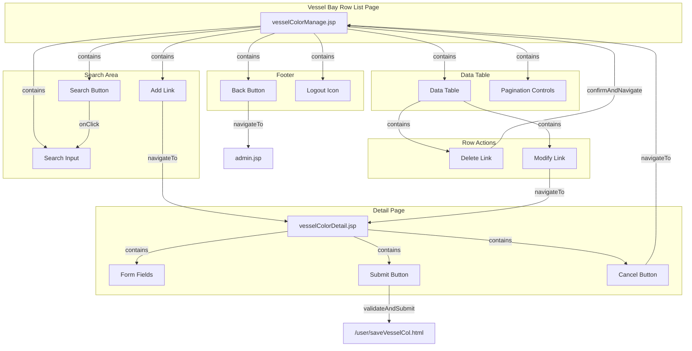

# Vessel Bay Row List - Technical Specification

## 1. Architecture & Component Tree

This is a legacy JSP-based web application using Spring MVC with JSTL tag libraries. The page follows a traditional server-side rendering pattern with no client-side framework.



> 📎 Source: src/main/webapp/WEB-INF/jsp/vesselColorManage.jsp → full template; src/main/webapp/WEB-INF/jsp/vesselColorDetail.jsp → full template

**Key Components**:
- **vesselColorManage.jsp**: Main list page with search, table, pagination
- **vesselColorDetail.jsp**: Add/Edit form page with validation
- **admin.jsp**: Parent navigation page
- **vmt.js**: Shared utility library (checkNumber function)

## 2. State Management

This is a stateless JSP application with no client-side state management framework. State is managed through:

### Server-Side State
- **Model attributes**: `pm` (pagination model with `datas`, `total`, `pagesize`), `searchKey`, `vesselCol` (form object), `result` (server response message)
- **Request parameters**: `key` (search keyword), `id` (record ID for modify/delete)
- **Session**: User authentication state (implicit via Spring Security or custom filter)

### Client-Side State
- **DOM state**: Form field values stored in input elements
- **JavaScript variables**: None persistent; all logic is event-driven

### Computed Values
- **pageURL**: Determined by presence of `searchKey` parameter
  ```jsp
  <c:if test="${! empty searchKey}">
      <c:set var="pageURL" value="searchVesselCol.html" />
  </c:if>
  <c:if test="${ empty searchKey}">
      <c:set var="pageURL" value="allVesselCol.html" />
  </c:if>
  ```

> 📎 Source: src/main/webapp/WEB-INF/jsp/vesselColorManage.jsp → pageURL logic (lines 100-105)

## 3. API Integration

### API Endpoints

| Endpoint | Method | Purpose | Parameters |
|----------|--------|---------|------------|
| `/user/allVesselCol.html` | GET | Load all vessel bay rows | None (pagination handled server-side) |
| `/user/searchVesselColor.html` | GET | Search vessel bay rows | `key` (search keyword, URL-encoded) |
| `/user/delVesselCol.html` | GET | Delete a vessel bay row | `id` (record ID) |
| `/user/modifyVesselCol.html` | GET | Load edit form | `id` (record ID) |
| `/user/addVesselCol.html` | GET | Load add form | None |
| `/user/saveVesselCol.html` | POST | Save/create vessel bay row | Form data: vesselid, deck_hold, bay, rowStart, rowEnd, tierStart, tierEnd, id (optional) |

### Request/Response Patterns

**List Page Response**:
- Server returns rendered HTML with `pm` model containing:
  - `pm.datas`: Array of vessel bay row objects
  - `pm.total`: Total record count
  - `pm.pagesize`: Page size for pagination

**Vessel Bay Row Object Structure**:
```json
{
  "id": "number",
  "vesselid": "string",
  "deck_hold": "string (A or B)",
  "bay": "string (numeric)",
  "rowStart": "number",
  "rowEnd": "number",
  "tierStart": "number (optional)",
  "tierEnd": "number (optional)"
}
```

**Save Response**:
- On success: Redirect to list page
- On failure: Re-render form with `result` attribute containing error message

> 📎 Source: src/main/webapp/WEB-INF/jsp/vesselColorManage.jsp → API links (lines 43, 66, 91-92); src/main/webapp/WEB-INF/jsp/vesselColorDetail.jsp → form action (line 205)

### Error Handling

**Client-Side Validation Errors**:
- Displayed in `<tr id="message">` element with red text
- Error messages are hardcoded in JavaScript `checkValue()` function
- Validation prevents form submission if errors exist

**Server-Side Errors**:
- Displayed in `<tr id="ess">` element when `${!empty result}`
- Message content comes from server-side `result` model attribute

⚠️ [ERR:no-loading] No loading indicators during form submission or page navigation. Users may click multiple times causing duplicate submissions.
> 📎 Source: src/main/webapp/WEB-INF/jsp/vesselColorDetail.jsp → form submit (lines 212, 269)

⚠️ [ERR:no-retry] No retry mechanism for failed API calls. Delete and search operations have no error recovery.
> 📎 Source: src/main/webapp/WEB-INF/jsp/vesselColorManage.jsp → search() and delete link (lines 41-44, 91)

## 4. Data Flow & Transformation

### Data Flow Diagram

```
User Action → HTTP Request → Spring Controller → Service Layer → Database
                                                        ↓
HTML Response ← JSP Rendering ← Model Attributes ← Domain Objects
```

### Form Data Transformation

**Input Validation** (`checkValue()` in vesselColorDetail.jsp):
1. Trim and validate each field
2. Convert string inputs to numbers for comparison (rowStart, rowEnd, tierStart, tierEnd)
3. Check parity (odd/even) using modulo operator
4. Display localized error messages

**Number Validation Utility** (`checkNumber()` in vmt.js):
```javascript
function checkNumber(str){
   if(str==null||str==""){
        return  false;
   }else if(str.length==0){
        return  false;
   }else{
         for(i=0;i<str.length;i++){
           if(str.charAt(i)<'0'||str.charAt(i)>'9'){
              return   false;
              break;
            }
         }
    }
   return true;
}
```

> 📎 Source: src/main/webapp/js/vmt.js → checkNumber() (lines 351-366)

**HTML Escaping**:
- All dynamic content uses `<c:out>` tag for automatic HTML entity encoding
- Prevents XSS attacks from user-supplied data

> 📎 Source: src/main/webapp/WEB-INF/jsp/vesselColorManage.jsp → c:out usage (lines 83-89)

### Enum Mapping

**deck_hold Field**:
- Value 'A': Represents Deck (甲板)
- Value 'B': Represents Hold (货舱)

> 📎 Source: src/main/webapp/WEB-INF/jsp/vesselColorDetail.jsp → select options (lines 221-232, 278-281)

## 5. Interaction Logic

### Dialog/Confirmation Patterns

**Delete Confirmation**:
```javascript
onclick="return confirm('<spring:message code="confirm_delete" />');"
```
- Uses browser native `confirm()` dialog
- Returns `false` to cancel navigation if user clicks Cancel

**Logout Confirmation**:
```javascript
function sh(){
    if(window.confirm("<spring:message code="confirm_logout" />")){
        window.location.href="logout.html";
    }
}
```

### Conditional Rendering

**Empty Data State**:
```jsp
<c:choose>
    <c:when test="${!empty pm.datas}">
        <!-- Render table rows -->
    </c:when>
</c:choose>
```
- If no data, table body is empty (no "no data" message displayed)

**Pagination URL Selection**:
```jsp
<c:if test="${! empty searchKey}">
    <c:set var="pageURL" value="searchVesselCol.html" />
</c:if>
<c:if test="${ empty searchKey}">
    <c:set var="pageURL" value="allVesselCol.html" />
</c:if>
```

### Form Validation Rules

**Validation Implementation** (checkValue function):
- Sequential validation with early return on first error
- Error message injected into `#show` element
- `#message` row made visible via `style.display=''`
- `#ess` row hidden via `style.display="none"`

**Validation Order**:
1. vesselid (required, max length)
2. deck_hold (required, enum check)
3. bay (required, numeric check)
4. rowStart (required, numeric check)
5. rowEnd (required, numeric check)
6. rowStart vs rowEnd (range and parity check)
7. tierStart (optional, numeric if present)
8. tierEnd (optional, numeric if present)
9. tierStart/tierEnd consistency (both or neither)
10. tierStart/tierEnd parity (must be even)
11. tierStart vs tierEnd (range check)

> 📎 Source: src/main/webapp/WEB-INF/jsp/vesselColorDetail.jsp → checkValue() (lines 40-191)

## 6. Error Handling

### Validation Error States

| Error Condition | Error Message | Display Location |
|-----------------|---------------|------------------|
| Empty vesselid | "Vessel Visit Id cannot be empty!" | #message row |
| vesselid too long | "Vessel Visit Id is too long!" | #message row |
| Empty deck_hold | "Deck Hold cannot be empty!" | #message row |
| Invalid deck_hold | "Deck Hold should be 'A' or 'B'!" | #message row |
| Empty bay | "The bay cannot be empty!" | #message row |
| Non-numeric bay | "The bay should be number!" | #message row |
| rowStart > rowEnd | "Start Row can't be larger than End Row!" | #message row |
| Parity mismatch | "Start Row, End Row should be both odd or even number!" | #message row |
| Tier inconsistency | "Please input Start Tier and End Tier together or both are blank." | #message row |
| Tier not even | "Start Tier, End Tier should be even number!" | #message row |

### Server Error Handling

- Server errors returned via `result` model attribute
- Displayed in `#ess` row with red styling
- No specific error codes or structured error responses

⚠️ [ERR:no-error-codes] Server errors lack structured error codes. Only plain text messages are returned, making it difficult to handle different error types programmatically.
> 📎 Source: src/main/webapp/WEB-INF/jsp/vesselColorDetail.jsp → result display (lines 260-262, 305-307)

⚠️ [ERR:no-timeout] No request timeout handling for form submissions. Long-running saves may leave users waiting indefinitely.
> 📎 Source: src/main/webapp/WEB-INF/jsp/vesselColorDetail.jsp → form submit (lines 212, 269)

## 7. Security

### Authentication & Authorization

- Logout functionality present with confirmation dialog
- Session-based authentication implied (redirect to login on session expiry detected in vmt.js)
- No explicit role-based access control on this page

⚠️ [OWASP:A01] No CSRF protection on form submissions. The save form uses POST but lacks anti-CSRF tokens.
> 📎 Source: src/main/webapp/WEB-INF/jsp/vesselColorDetail.jsp → form:form (lines 212, 269)

⚠️ [OWASP:A01] Delete operation uses GET method instead of POST/DELETE. This violates REST conventions and makes deletion vulnerable to CSRF attacks via image tags or links.
> 📎 Source: src/main/webapp/WEB-INF/jsp/vesselColorManage.jsp → delete link (line 91)

### Input Sanitization

- All output uses `<c:out>` for HTML escaping (good practice)
- Search input is URL-encoded before use
- No server-side input validation visible in JSP layer (assumed to be in controller/service)

⚠️ [OWASP:A03] Search parameter passed directly to URL without server-side sanitization visible. Potential for injection if backend doesn't properly parameterize queries.
> 📎 Source: src/main/webapp/WEB-INF/jsp/vesselColorManage.jsp → search() function (line 43)

### Data Exposure

- No sensitive data (passwords, tokens) visible in this page
- Record IDs exposed in URLs (standard for this architecture)

## 8. Performance

### Rendering Optimization

- Server-side rendering eliminates client-side JavaScript overhead
- Pagination limits data per page (controlled by `pm.pagesize`)
- No lazy loading or virtualization (not applicable for server-rendered tables)

### Bundle Size

- Single shared JS file: `vmt.js` (~366 lines)
- No framework dependencies (jQuery used in vmt.js but not in these pages)
- Minimal CSS inline in JSP files

⚠️ [PERF:main-thread] All form validation runs synchronously on main thread. For forms with many fields, this could cause UI blocking, though current form is small enough to not be problematic.
> 📎 Source: src/main/webapp/WEB-INF/jsp/vesselColorDetail.jsp → checkValue() (lines 40-191)

### Network Efficiency

- Search and list operations use separate endpoints (good separation)
- No caching headers visible in JSP templates
- No AJAX usage in these pages (full page reloads for all operations)

⚠️ [PERF:no-caching] No cache-control headers or ETags configured. Every page load fetches fresh data from server, increasing latency and server load.
> 📎 Source: src/main/webapp/WEB-INF/jsp/vesselColorManage.jsp → meta tags (lines 9-10)

⚠️ [PERF:full-reload] All user actions (search, add, edit, delete) trigger full page reloads instead of partial updates. This increases bandwidth usage and reduces perceived responsiveness.
> 📎 Source: src/main/webapp/WEB-INF/jsp/vesselColorManage.jsp → window.location.href usage (lines 43, 47, 52)
