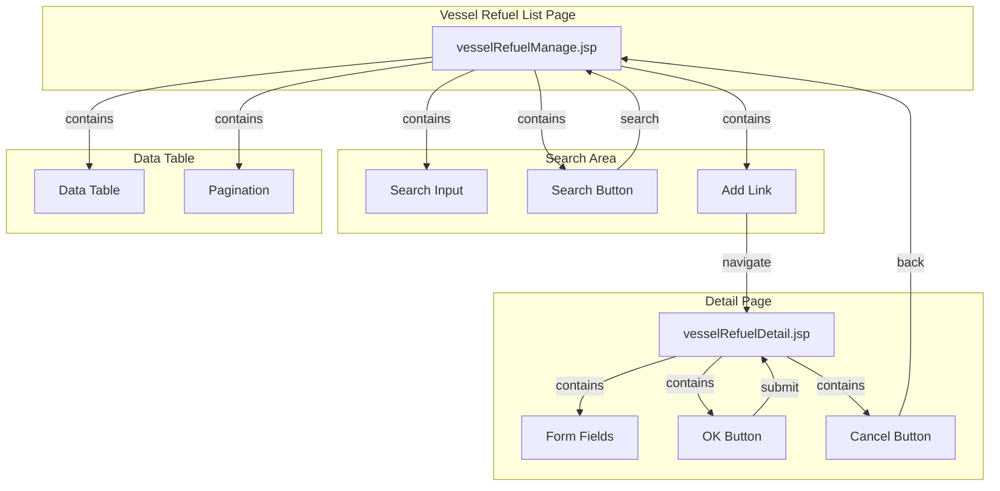

# Vessel Refuel List - Technical Specification

## 1. Architecture & Component Tree

This is a legacy JSP-based web application using Spring MVC framework with server-side rendering.



**Component Structure**:
- **Page Component**: `vesselRefuelManage.jsp` - Main list page with search, table, and pagination
- **Detail Component**: `vesselRefuelDetail.jsp` - Form page for add/modify operations (shared by both modes)
- **Backend Controller**: `CellControl.java` - Handles all vessel refuel CRUD operations
- **DAO Layer**: `VesselDaoImpl.java` - Data access using Hibernate
- **Entity**: `VesselRefuel.java` - JPA entity mapped to `T_VesselRefuel` table

> 📎 Source: src/main/webapp/WEB-INF/jsp/vesselRefuelManage.jsp; src/main/webapp/WEB-INF/jsp/vesselRefuelDetail.jsp; src/main/java/com/springMVC/control/CellControl.java

## 2. State Management

This is a server-side rendered application with no client-side state management framework. State is managed through:

### Server-Side State
- **Session Attributes**: User login information stored in session (`Constants.USER_LOGIN`, `Constants.QC_ID`)
- **Request Parameters**: Pagination offset, search key, record ID passed via URL parameters
- **Model Attributes**: 
  - `pm` (PageManage) - Contains paginated data list, total count, offset, pagesize
  - `searchKey` - Current search keyword for display and pagination context
  - `vesselRefuel` - Entity object for edit mode pre-population
  - `result` - Error message from failed operations

### Client-Side State
- **DOM State**: Form validation messages displayed via `display` CSS property toggling
- **Hidden Fields**: Record `id` stored in hidden input for update operations

**State Flow**:
```
User Action → HTTP Request → Controller → DAO → Database
                ↓
            ModelMap populated
                ↓
            JSP Rendering → HTML Response → Browser Display
```

> 📎 Source: src/main/java/com/springMVC/control/CellControl.java → getVesselRefuel(); src/main/webapp/WEB-INF/jsp/vesselRefuelManage.jsp → model attributes

## 3. API Integration

All APIs are traditional Spring MVC controller endpoints returning ModelAndView (server-side rendered views).

### 3.1 List All Records
- **Endpoint**: `GET /user/allVesselRefuel.html`
- **Parameters**: `pager.offset` (optional, default 0)
- **Response**: Renders `vesselRefuelManage.jsp` with `pm` model attribute
- **Pagination**: 10 records per page, ordered by vesselid

> 📎 Source: src/main/java/com/springMVC/control/CellControl.java → getVesselRefuel()

### 3.2 Search Records
- **Endpoint**: `GET /user/searchVesselRefuel.html`
- **Parameters**: 
  - `key` - Search keyword (URL encoded)
  - `pager.offset` (optional, default 0)
- **Response**: Renders `vesselRefuelManage.jsp` with filtered results
- **Search Logic**: Fuzzy match on `vesselid` OR `is_refuel` fields using SQL LIKE

> 📎 Source: src/main/java/com/springMVC/control/CellControl.java → searchVesselRefuel(); src/main/java/com/springMVC/dao/VesselDaoImpl.java → searchVesselRefuel()

### 3.3 Add Record (GET - Show Form)
- **Endpoint**: `GET /user/addVesselRefuel.html`
- **Response**: Renders empty `vesselRefuelDetail.jsp` form

> 📎 Source: src/main/java/com/springMVC/control/CellControl.java → addVesselRefuel()

### 3.4 Modify Record (GET - Show Form)
- **Endpoint**: `GET /user/modifyVesselRefuel.html`
- **Parameters**: `id` - Record ID
- **Response**: Renders `vesselRefuelDetail.jsp` with pre-populated form data

> 📎 Source: src/main/java/com/springMVC/control/CellControl.java → updateVesselRefuel()

### 3.5 Delete Record
- **Endpoint**: `GET /user/delVesselRefuel.html`
- **Parameters**: `id` - Record ID
- **Response**: Redirects to `/user/allVesselRefuel.html`
- **Side Effects**: Logs operation via `LogUtil.buildOperationLog()`

> 📎 Source: src/main/java/com/springMVC/control/CellControl.java → delVesselRefuel()

### 3.6 Save/Update Record (POST)
- **Endpoint**: `POST /user/updateVesselRefuelStatus.html`
- **Parameters**: 
  - `vesselid` - Vessel visit ID (max 30 chars)
  - `is_refuel` - "Yes" or "No"
  - `id` - Record ID (present for update, absent for create)
- **Response**: 
  - Success: Redirects to `/user/allVesselRefuel.html`
  - Failure: Re-renders `vesselRefuelDetail.jsp` with error message in `result` model attribute
- **Logic**: If `id` present → update existing record; otherwise → create new record

> 📎 Source: src/main/java/com/springMVC/control/CellControl.java → updateVesselRefuelStatus()

### Request/Response Schema

**VesselRefuel Entity**:
```json
{
  "id": "Integer (auto-generated sequence)",
  "vesselid": "String (max 30 chars, DB column length 10)",
  "is_refuel": "String (max 3 chars, DB column length 5, values: 'Yes'/'No')"
}
```

**PageManage Response Structure**:
```json
{
  "total": "Integer (total record count)",
  "datas": "Array<VesselRefuel>",
  "offset": "Integer (current page offset)",
  "pagesize": "Integer (always 10)"
}
```

> 📎 Source: src/main/java/com/springMVC/entity/VesselRefuel.java; src/main/java/com/springMVC/entity/PageManage.java

## 4. Data Flow & Transformation

### 4.1 Data Flow Diagram

```
Database (T_VesselRefuel)
    ↓ Hibernate Query
VesselDaoImpl.getAllVesselRefuel() / searchVesselRefuel()
    ↓ Returns PageManage
CellControl.getVesselRefuel() / searchVesselRefuel()
    ↓ Populates ModelMap
JSP Template (vesselRefuelManage.jsp)
    ↓ JSTL/c:forEach Rendering
HTML Table Rows
    ↓ Browser Display
User View
```

### 4.2 Data Transformation Rules

| Field | Source | Transformation | Output |
|-------|--------|----------------|--------|
| vesselid | Database VARCHAR(10) | Direct output via `<c:out>` | Plain text in table cell |
| is_refuel | Database VARCHAR(5) | Direct output via `<c:out>` | "Yes" or "No" text |
| Pagination links | PageManage properties | JSTL conditional rendering | Current page highlighted in red |
| Search context | Request parameter `key` | Stored in model as `searchKey` | Used to determine pagination URL |

### 4.3 Form Data Binding

**Edit Mode**: 
- Controller fetches entity by ID: `vesselDao.getVesselRefuelById(id)`
- Entity added to model: `model.addObject("vesselRefuel", vesselRefuel2)`
- JSP uses `<form:form modelAttribute="vesselRefuel">` for automatic field binding
- Dropdown selection determined by JSTL `<c:choose>` comparing current value

**Create Mode**:
- No entity in model, form renders with empty/default values
- Dropdown defaults to first option ("Yes")

> 📎 Source: src/main/java/com/springMVC/control/CellControl.java → updateVesselRefuel(); src/main/webapp/WEB-INF/jsp/vesselRefuelDetail.jsp → form:form

## 5. Interaction Logic

### 5.1 Form Validation (Client-Side)

Validation function `checkValue()` executes on form submit:

```javascript
function checkValue(){
    // Clear previous error messages
    document.getElementById("ess").style.display="none";
    document.getElementById("message").style.display="none";

    var vesselid = document.getElementById("vesselid").value;
    var is_refuel = document.getElementById("is_refuel").value;

    // Validate vesselid
    if(vesselid==""){
        document.getElementById("show").innerHTML = "Vessel Visit Id cannot be empty!";
        document.getElementById("message").style.display='';
        return false;
    }else{
        if(vesselid.length>30){
            document.getElementById("show").innerHTML = "Vessel Visit Id is too long!";
            document.getElementById("message").style.display='';
            return false;
       }
    }
    
    // Validate is_refuel
    if(is_refuel ==""){
        document.getElementById("show").innerHTML = "Is Refuel cannot be empty!";
        document.getElementById("message").style.display='';
        return false;
    }else{
        if(is_refuel.length>3){
            document.getElementById("show").innerHTML = "Is Refuel is too long!";
            document.getElementById("message").style.display='';
            return false;
        }else if((is_refuel !="Yes")&&(is_refuel !="No")){
            document.getElementById("show").innerHTML = "Is Refuel should be 'Yes' or 'No'!";
            document.getElementById("message").style.display='';
            return false;
        }
    }

    return true;
}
```

**Validation Rules Summary**:
- `vesselid`: Required, max 30 characters
- `is_refuel`: Required, must be exactly "Yes" or "No", max 3 characters

> 📎 Source: src/main/webapp/WEB-INF/jsp/vesselRefuelDetail.jsp → checkValue()

### 5.2 Conditional Rendering

**List Page**:
- Data rows: `<c:when test="${!empty pm.datas}">` - Only renders table rows when data exists
- Pagination URL: `<c:if test="${! empty searchKey}">` determines whether to use search or list endpoint

**Detail Page**:
- Edit vs Create mode: `<c:choose><c:when test="${!empty vesselRefuel}">` determines which form variant to render
- Error message display: `<c:if test="${!empty result }">` shows server-side error messages

> 📎 Source: src/main/webapp/WEB-INF/jsp/vesselRefuelManage.jsp → c:choose, c:if; src/main/webapp/WEB-INF/jsp/vesselRefuelDetail.jsp → c:choose

### 5.3 Dialog/Confirmation Patterns

**Delete Confirmation**:
```javascript
onclick="return confirm('<spring:message code="confirm_delete" />');"
```
- Uses browser native `confirm()` dialog
- Internationalized message via Spring message tag
- Returns `false` cancels the navigation

**Logout Confirmation**:
```javascript
function sh(){
    if(window.confirm("<spring:message code="confirm_logout" />")){
        window.location.href="logout.html";
    }
}
```

> 📎 Source: src/main/webapp/WEB-INF/jsp/vesselRefuelManage.jsp → del link onclick, sh()

## 6. Error Handling

### 6.1 Client-Side Validation Errors

| Error Condition | Error Message | Display Method |
|-----------------|---------------|----------------|
| vesselid empty | "Vessel Visit Id cannot be empty!" | Red text in `#show` element |
| vesselid > 30 chars | "Vessel Visit Id is too long!" | Red text in `#show` element |
| is_refuel empty | "Is Refuel cannot be empty!" | Red text in `#show` element |
| is_refuel > 3 chars | "Is Refuel is too long!" | Red text in `#show` element |
| is_refuel not Yes/No | "Is Refuel should be 'Yes' or 'No'!" | Red text in `#show` element |

### 6.2 Server-Side Errors

| Error Condition | Error Message | Handling |
|-----------------|---------------|----------|
| Database save/update failure | "The operation failed" | Re-renders form with `result` model attribute |
| Database connection error | Caught and logged, generic error page | Exception caught in controller, stack trace printed |

⚠️ [ERR:async] Delete operation has no try-catch around `vesselDao.deleteVesselRefuelById()`, exceptions will propagate and cause 500 errors
> 📎 Source: src/main/java/com/springMVC/control/CellControl.java → delVesselRefuel()

⚠️ [ERR:async] Search operation catches NumberFormatException silently but does not handle other potential exceptions from DAO layer
> 📎 Source: src/main/java/com/springMVC/control/CellControl.java → searchVesselRefuel()

### 6.3 Loading States

**No loading indicators implemented** - This is a traditional server-side rendered application where page navigation triggers full page reloads. Users see browser's native loading indicator.

## 7. Security

### 7.1 Authentication & Authorization

- **Authentication**: Session-based authentication via `SecurityInterceptor`
- **Authorization**: Role-based access control - ADMIN role required for vessel refuel management
- **Session Management**: User object stored in session (`Constants.USER_LOGIN`)

⚠️ [OWASP:A01] No explicit permission checks in controller methods - relies solely on interceptor-level security
> 📎 Source: src/main/java/com/springMVC/control/CellControl.java → all vessel refuel endpoints

### 7.2 CSRF Protection

⚠️ [OWASP:A01] Form submissions use POST but no CSRF token implementation visible in the codebase
> 📎 Source: src/main/webapp/WEB-INF/jsp/vesselRefuelDetail.jsp → form:form method="POST"

### 7.3 Input Sanitization

- **XSS Prevention**: Uses `<c:out>` JSTL tag which automatically escapes HTML entities
- **SQL Injection**: Uses Hibernate HQL with parameterized queries (`setString()`) preventing SQL injection

> 📎 Source: src/main/webapp/WEB-INF/jsp/vesselRefuelManage.jsp → c:out; src/main/java/com/springMVC/dao/VesselDaoImpl.java → setString()

### 7.4 Sensitive Data Exposure

⚠️ [OWASP:A02] Record IDs exposed in URL parameters (`?id={id}`) for modify and delete operations
> 📎 Source: src/main/webapp/WEB-INF/jsp/vesselRefuelManage.jsp → del and modify links

⚠️ [OWASP:A02] Search keywords passed in URL query string, potentially exposing search patterns in browser history and server logs
> 📎 Source: src/main/webapp/WEB-INF/jsp/vesselRefuelManage.jsp → search() function

## 8. Performance

### 8.1 Pagination Strategy

- **Page Size**: Fixed at 10 records per page
- **Offset-Based Pagination**: Uses `pager.offset` parameter with Hibernate `setFirstResult()` and `setMaxResults()`
- **Query Optimization**: Separate count query and data query for pagination metadata

> 📎 Source: src/main/java/com/springMVC/dao/VesselDaoImpl.java → getAllVesselRefuel()

### 8.2 Rendering Performance

⚠️ [PERF:re-render] Full page reload on every interaction (search, pagination, CRUD operations) - no AJAX or partial updates
> 📎 Source: src/main/webapp/WEB-INF/jsp/vesselRefuelManage.jsp → window.location.href navigation

⚠️ [PERF:no-lazy] No lazy loading or virtualization for table data - entire page rendered server-side
> 📎 Source: src/main/webapp/WEB-INF/jsp/vesselRefuelManage.jsp → c:forEach rendering

### 8.3 Query Performance

- **Indexing**: Queries order by `vesselid` - ensure database index exists on this column
- **Search Query**: Uses LIKE with wildcards on both sides (`%key%`) which prevents index usage and may be slow on large datasets

⚠️ [PERF:large-list] Search uses `%key%` pattern matching on two columns without database indexing consideration
> 📎 Source: src/main/java/com/springMVC/dao/VesselDaoImpl.java → searchVesselRefuel()

### 8.4 Bundle Size

- **Legacy Technology**: JSP with inline JavaScript and CSS - no modern bundling or minification
- **External Dependencies**: Uses `vmt.js` utility script (versioned with `?v=3` cache busting)

> 📎 Source: src/main/webapp/WEB-INF/jsp/vesselRefuelDetail.jsp → script src
