# Bay Configuration Module - Technical Specification

## 1. Architecture & Service Layer

### 1.1 Service Interfaces

**CellDao Interface** (`src/main/java/com/springMVC/dao/CellDao.java`)
- 舱位矩阵和颜色方案的数据访问接口
- 核心方法：
  - `getCells(String vesselid, String qcid)`: 获取指定QC的作业序列和舱位占用信息
  - `getBaySize()`: 查询舱位矩阵尺寸
  - `updateCellMatrix(BaySize baySize)`: 更新舱位矩阵激活状态
  - `saveOrUpdateColSet(ColSet colSet)`: 保存或更新颜色方案
  - `delColSet(int id)`: 删除颜色方案
  - `getAllCol(int offset)`: 分页查询颜色方案

**VesselDao Interface** (`src/main/java/com/springMVC/dao/VesselDao.java`)
- 船舶配置、加油配置、舱位行列配置的数据访问接口
- 核心方法：
  - `saveOrUpdateVessel(Vessel vessel)`: 保存或更新船舶配置
  - `getAllVessel(int offset)`: 分页查询船舶列表
  - `searchVessel(int offset, String key)`: 搜索船舶
  - `saveOrUpdateVesselRefuel(VesselRefuel vr)`: 保存或更新加油配置
  - `saveOrUpdateVesselCol(VesselCol vesselCol)`: 保存或更新舱位行列配置
  - `saveOperationLog(OperationLog log)`: 保存操作日志

### 1.2 Implementation Hierarchy

```
Controller Layer:
  CellControl (Spring MVC Controller)
    ├── @Resource CellDao cellDao
    └── @Resource VesselDao vesselDao

DAO Layer:
  CellDaoImpl implements CellDao
    ├── @Resource HibernateTemplate hibernateTemplate
    ├── @Resource JdbcTemplate jdbcTemplate
    └── Static HashMap cellMatrixHM (缓存，未实际使用)
  
  VesselDaoImpl implements VesselDao
    ├── @Resource HibernateTemplate hibernateTemplate
    └── @Resource JdbcTemplate jdbcTemplate

Business Handler:
  Busihandler (静态工具类)
    └── returnResponse(): 处理实时业务查询请求
```

### 1.3 Dependency Injection

- 使用Spring的`@Resource`注解进行依赖注入
- CellControl同时注入CellDao和VesselDao
- DAO实现类使用`@Repository`和`@Service`双重注解（冗余，建议保留其一）
- 事务管理使用`@Transactional`注解，传播行为为`SUPPORTS`（默认）或`REQUIRED`（写操作）

> 📎 Source: src/main/java/com/springMVC/control/CellControl.java → CellControl; src/main/java/com/springMVC/dao/CellDaoImpl.java → CellDaoImpl; src/main/java/com/springMVC/dao/VesselDaoImpl.java → VesselDaoImpl

## 2. API Contracts

### 2.1 Request/Response Schemas

#### GET /user/setbay
**Request:** 无参数
**Response:** ModelAndView("setbaysize")
- Model属性：
  - `baySize`: BaySize对象（deckRows, deckTiers, holdRows, holdTiers）
  - `baymsg`: 错误消息（可选）

#### POST /user/updateBay
**Request:** 
- Form参数：holdTiers（从request.getParameter获取）
- @ModelAttribute BaySize对象（包含deckRows, deckTiers, holdRows）
**Response:** 
- 成功：Redirect to "/user/all.html"
- 失败：ModelAndView("setbaysize") with `baymsg` error message

#### GET /user/BusiQuery
**Request:** 
- Query参数：qcNum（岸桥编号）
**Response:** 
- Content-Type: text/xml; charset=UTF-8
- XML格式响应，包含作业信息和HTML表格

#### GET /user/allColSet
**Request:** 
- Query参数：pager.offset（分页偏移量，默认0）
**Response:** ModelAndView("colorManage")
- Model属性：`pm` (PageManage对象)

#### POST /user/saveColSet
**Request:** 
- Form参数：boxcase, color
**Response:** 
- 成功：Redirect to "/user/allColSet.html"
- 失败：ModelAndView("colSetDetail") with `result` error message

#### POST /user/updateColSet
**Request:** 
- Form参数：id, color
**Response:** 
- 成功：Redirect to "/user/allColSet.html"
- 失败：ModelAndView("updateColSet") with `result` error message

#### GET /user/delColSet
**Request:** 
- @ModelAttribute ColSet对象（包含id）
**Response:** Redirect to "/user/allColSet.html"

#### GET /user/allVessel
**Request:** 
- Query参数：pager.offset（分页偏移量，默认0）
**Response:** ModelAndView("vesselManage")
- Model属性：`pm` (PageManage对象)

#### POST /user/saveVessel
**Request:** 
- Form参数：vesselid, deck_hold, bay, rowStart, rowEnd, tierStart, tierEnd
**Response:** 
- 成功：Redirect to "/user/allVessel.html"
- 失败：ModelAndView("vesselDetail") with `result` error message（如果唯一性校验失败）

#### POST /user/updateVessel
**Request:** 
- Form参数：id, vesselid, deck_hold, bay, rowStart, rowEnd, tierStart, tierEnd
**Response:** 
- 成功：Redirect to "/user/allVessel.html"
- 失败：ModelAndView("updateVessel") with `result` error message

#### GET /user/delVessel
**Request:** 
- @ModelAttribute Vessel对象（包含id）
**Response:** Redirect to "/user/allVessel.html"

#### GET /user/searchVessel
**Request:** 
- Query参数：key（搜索关键字）, pager.offset
**Response:** ModelAndView("vesselManage")
- Model属性：`pm` (PageManage), `searchKey`

#### GET /user/allVesselRefuel
**Request:** 
- Query参数：pager.offset（分页偏移量，默认0）
**Response:** ModelAndView("vesselRefuelManage")
- Model属性：`pm` (PageManage对象)

#### POST /user/updateVesselRefuelStatus
**Request:** 
- Form参数：vesselid, is_refuel, id（可选，有则为更新，无则为新增）
**Response:** 
- 成功：Redirect to "/user/allVesselRefuel.html"
- 失败：ModelAndView("vesselRefuelDetail") with `result` error message

#### GET /user/delVesselRefuel
**Request:** 
- @ModelAttribute VesselRefuel对象（包含id）
**Response:** Redirect to "/user/allVesselRefuel.html"
- Side effect: 记录操作日志

#### GET /user/allVesselCol
**Request:** 
- Query参数：pager.offset（分页偏移量，默认0）
**Response:** ModelAndView("vesselColorManage")
- Model属性：`pm` (PageManage对象)

#### POST /user/saveVesselCol
**Request:** 
- Form参数：vesselid, deck_hold, bay, rowStart, rowEnd, tierStart, tierEnd, id（可选）
**Response:** 
- 成功：Redirect to "/user/allVesselCol.html"
- 失败：ModelAndView("vesselColorDetail") with `result` error message

#### GET /user/delVesselCol
**Request:** 
- @ModelAttribute VesselCol对象（包含id）
**Response:** Redirect to "/user/allVesselCol.html"
- Side effect: 记录操作日志

### 2.2 Validation Rules

**服务端校验：**
- 箱型名称唯一性：在saveColSet中通过`cellDao.getColSetByBoxcase(boxcase)`检查
- 船舶配置唯一性：在saveVessel/updateVessel中通过`vesselDao.getVesselByCondition(vesselid, deck_hold, bay)`检查
- 数字格式校验：offset参数解析失败时捕获NumberFormatException，默认为0

**客户端校验：** TBD（前端JSP页面中的JavaScript校验）

### 2.3 Status Codes

- HTTP 200: 所有请求均返回200，错误通过页面消息或XML错误标签传达
- 重定向：使用HTTP 302进行页面跳转

> 📎 Source: src/main/java/com/springMVC/control/CellControl.java → all methods

## 3. Data Model

### 3.1 Table Schema

| Table | Column | Type | Constraint | Description |
|-------|--------|------|------------|-------------|
| T_COLSET | colsetid | INTEGER | PK, Sequence (colset_seq) | 颜色方案ID |
| T_COLSET | COLOR | VARCHAR(15) | | 颜色值 |
| T_COLSET | BOXCASE | VARCHAR(10) | | 箱型名称 |
| T_VESSEL | vmid | INTEGER | PK, Sequence (vessel_seq) | 船舶配置ID |
| T_VESSEL | vesselid | VARCHAR(10) | | 船名 |
| T_VESSEL | deck_hold | VARCHAR(10) | | 甲板/舱内标识（A/B） |
| T_VESSEL | bay | VARCHAR(10) | | Bay号 |
| T_VESSEL | rowstart | VARCHAR(10) | | 起始行号 |
| T_VESSEL | rowend | VARCHAR(10) | | 结束行号 |
| T_VESSEL | tierstart | VARCHAR(10) | | 起始层号 |
| T_VESSEL | tierend | VARCHAR(10) | | 结束层号 |
| T_VesselRefuel | vrid | INTEGER | PK, Sequence (vesselRefuel_seq) | 加油配置ID |
| T_VesselRefuel | vesselid | VARCHAR(10) | | 船名 |
| T_VesselRefuel | is_refuel | VARCHAR(5) | | 加油状态（Yes/No） |
| T_VESSELCOL | vcid | INTEGER | PK, Sequence (vesselCol_seq) | 舱位行列配置ID |
| T_VESSELCOL | vesselid | VARCHAR(10) | | 船名 |
| T_VESSELCOL | deck_hold | VARCHAR(10) | | 甲板/舱内标识 |
| T_VESSELCOL | bay | VARCHAR(10) | | Bay号 |
| T_VESSELCOL | rowstart | VARCHAR(10) | | 起始行号 |
| T_VESSELCOL | rowend | VARCHAR(10) | | 结束行号 |
| T_VESSELCOL | tierstart | VARCHAR(10) | | 起始层号 |
| T_VESSELCOL | tierend | VARCHAR(10) | | 结束层号 |
| T_CELLMATRIX | matrixid | INTEGER | PK, Identity | 舱位矩阵ID |
| T_CELLMATRIX | cmtype | VARCHAR(4) | | 类型（A=甲板/B=舱内） |
| T_CELLMATRIX | cmrow | VARCHAR(4) | | 行号 |
| T_CELLMATRIX | cmtier | VARCHAR(4) | | 层号 |
| T_CELLMATRIX | active | VARCHAR(2) | | 激活状态（1=激活/0=禁用） |
| T_OPERATION_LOG | OPERLOGID | INTEGER(7) | PK, Sequence (operatorlog_seq) | 操作日志ID |
| T_OPERATION_LOG | USERID | INTEGER(7) | | 用户ID |
| T_OPERATION_LOG | USERNAME | VARCHAR(20) | | 用户名 |
| T_OPERATION_LOG | FUNCTION | VARCHAR(50) | | 功能模块 |
| T_OPERATION_LOG | ACTIONTYPE | VARCHAR(10) | | 操作类型（SAVE/UPDATE/DELETE） |
| T_OPERATION_LOG | VALUECHANGE | VARCHAR(300) | | 变更内容 |
| T_OPERATION_LOG | TIME | TIMESTAMP | | 操作时间 |

> 📎 Source: src/main/java/com/springMVC/entity/ColSet.java → ColSet; src/main/java/com/springMVC/entity/Vessel.java → Vessel; src/main/java/com/springMVC/entity/VesselRefuel.java → VesselRefuel; src/main/java/com/springMVC/entity/VesselCol.java → VesselCol; src/main/java/com/springMVC/entity/CellMatrix.java → CellMatrix; src/main/java/com/springMVC/entity/OperationLog.java → OperationLog

### 3.2 Class Diagram

```mermaid
classDiagram
    class CellControl {
        +MessageUtil messageUtil
        -CellDao cellDao
        -VesselDao vesselDao
        +setBaySize() ModelAndView
        +updateBay() ModelAndView
        +busiQuery() void
        +getAllColSet() ModelAndView
        +delUser() ModelAndView
        +addUser() ModelAndView
        +modUser() ModelAndView
        +updateUser() ModelAndView
        +saveColSet() ModelAndView
        +getVessel() ModelAndView
        +delVessel() ModelAndView
        +addVessel() ModelAndView
        +modVessel() ModelAndView
        +updateVessel() ModelAndView
        +saveVessel() ModelAndView
        +searchCompanyTractor() ModelAndView
        +getVesselRefuel() ModelAndView
        +searchVesselRefuel() ModelAndView
        +addVesselRefuel() ModelAndView
        +updateVesselRefuel() ModelAndView
        +delVesselRefuel() ModelAndView
        +updateVesselRefuelStatus() ModelAndView
        +getVesselCol() ModelAndView
        +searchVesselCol() ModelAndView
        +addVesselBayColor() ModelAndView
        +modVesselCol() ModelAndView
        +delVesselCol() ModelAndView
        +saveOrUpdateVesselCol() ModelAndView
    }

    class CellDao {
        <<interface>>
        +getCells() HashMap
        +getColSet() List
        +getBaySize() BaySize
        +updateCellMatrix() void
        +saveOrUpdateColSet() boolean
        +delColSet() boolean
        +getColSetByBoxcase() ColSet
        +getColSetById() ColSet
        +getAllCol() PageManage
    }

    class CellDaoImpl {
        -HibernateTemplate hibernateTemplate
        -JdbcTemplate jdbcTemplate
        +getCells() HashMap
        +getCellMatrixFromnN4() List
        +getCellMatrix() List
        +getQorder() HashMap
        +getLoadOrder() HashMap
        +getDischargeOrder() HashMap
        +checkSequenceList() HashMap
        +getSequenceList() HashMap
        +getROBList() HashMap
        +buildBay() String
        +getBaySize() BaySize
        +updateCellMatrix() void
        +saveOrUpdateColSet() boolean
        +delColSet() boolean
        +getAllCol() PageManage
    }

    class VesselDao {
        <<interface>>
        +save() void
        +getAllVessel() PageManage
        +deleteById() void
        +getVesselById() Vessel
        +update() void
        +saveOrUpdateVessel() boolean
        +getVesselByCondition() List
        +searchVessel() PageManage
        +getAllVesselCol() PageManage
        +searchVesselCol() PageManage
        +getVesselColById() VesselCol
        +saveOrUpdateVesselCol() boolean
        +deleteVesselColById() void
        +getAllVesselRefuel() PageManage
        +searchVesselRefuel() PageManage
        +getVesselRefuelById() VesselRefuel
        +deleteVesselRefuelById() void
        +saveOrUpdateVesselRefuel() boolean
        +saveOperationLog() void
    }

    class VesselDaoImpl {
        -HibernateTemplate hibernateTemplate
        -JdbcTemplate jdbcTemplate
        +save() void
        +getAllVessel() PageManage
        +saveOrUpdateVessel() boolean
        +searchVessel() PageManage
        +saveOrUpdateVesselCol() boolean
        +saveOrUpdateVesselRefuel() boolean
        +saveOperationLog() void
    }

    class Busihandler {
        +returnResponse() void
    }

    class BaySize {
        -String deckRows
        -String deckTiers
        -String holdRows
        -String holdTiers
    }

    class ColSet {
        -Integer id
        -String color
        -String boxcase
    }

    class Vessel {
        -Integer id
        -String vesselid
        -String deck_hold
        -String bay
        -String rowStart
        -String rowEnd
        -String tierStart
        -String tierEnd
    }

    class VesselRefuel {
        -Integer id
        -String vesselid
        -String is_refuel
    }

    class VesselCol {
        -Integer id
        -String vesselid
        -String deck_hold
        -String bay
        -String rowStart
        -String rowEnd
        -String tierStart
        -String tierEnd
    }

    class CellMatrix {
        -Integer id
        -String type
        -String row
        -String tier
        -String active
        -String tierStart
        -String tierEnd
    }

    class SequenceVO {
        -String current_pos_slot
        -String qtype
        -String planned_pos_slot
        -String pos_locid
        -String qdeck
        -String qrow
        -String bay
        -String is_oog
        -String is_powered
        -String istank
        -String isquad
        -String istandem
        -String istwin
        -String issingle
        -String status
        -String complexunit
        -String twentyInd
        -String is_dg
    }

    class PageManage {
        -List datas
        -int total
        -int pagesize
        -int offset
        -int userid
    }

    class OperationLog {
        -int id
        -int userid
        -String username
        -String function
        -String actionType
        -String valuechange
        -Date time
    }

    CellControl --> CellDao : uses
    CellControl --> VesselDao : uses
    CellDaoImpl ..|> CellDao : implements
    VesselDaoImpl ..|> VesselDao : implements
    Busihandler --> CellDao : uses
    CellDaoImpl --> BaySize : creates
    CellDaoImpl --> ColSet : manages
    CellDaoImpl --> CellMatrix : queries
    CellDaoImpl --> SequenceVO : builds
    VesselDaoImpl --> Vessel : manages
    VesselDaoImpl --> VesselRefuel : manages
    VesselDaoImpl --> VesselCol : manages
    VesselDaoImpl --> OperationLog : saves
    CellControl --> PageManage : returns
```



> 📎 Source: src/main/java/com/springMVC/control/CellControl.java; src/main/java/com/springMVC/dao/CellDaoImpl.java; src/main/java/com/springMVC/dao/VesselDaoImpl.java; src/main/java/com/accenture/vmt/Busihandler.java

## 4. Data Access Logic

### 4.1 Query Conditions

**舱位矩阵查询（getCellMatrix）：**
```sql
FROM CellMatrix WHERE type = ? AND active = '1' ORDER BY id DESC
```
- 参数：qdeck（A或B）
- 隐式过滤：仅查询激活状态的记录

**船舶配置唯一性检查（getVesselByCondition）：**
```sql
FROM Vessel WHERE vesselid = ? AND deck_hold = ? AND bay = ?
```
- 参数：vesselid, deck_hold, bay
- 用途：防止重复配置

**颜色方案唯一性检查（getColSetByBoxcase）：**
```sql
FROM ColSet c WHERE c.boxcase = ?
```
- 参数：boxcase
- 用途：确保箱型名称唯一

**分页查询模式（所有列表查询）：**
```java
session.createQuery(hql).setFirstResult(offset).setMaxResults(10).list()
```
- 固定每页10条记录
- offset从请求参数`pager.offset`获取，解析失败时默认为0

**模糊搜索模式：**
```sql
FROM Vessel WHERE vesselid LIKE :vesselid OR deck_hold LIKE :deckhold OR bay LIKE :bay
```
- 参数：'%key%'（前后通配符）
- 支持多字段OR匹配

### 4.2 N4系统复杂查询

**作业队列查询（getLoadOrder/getDischargeOrder）：**
- 多表JOIN：MN4O_QC_inv_wq, MN4O_QC_inv_wi, MN4O_QC_inv_unit_yrd_visit, MN4O_QC_inv_unit_fcy_visit, MN4O_QC_inv_unit, MN4O_QC_xps_craneshift, MN4O_QC_xps_pointofwork, MN4O_QC_ref_equipment, MN4O_QC_inv_goods, MN4O_QC_argo_carrier_visit
- 过滤条件：
  - acv.phase NOT IN ('60DEPARTED', '70CLOSED', '80CANCELED', '90ARCHIVED')
  - iq.qtype IN ('LOAD') 或 ('DISCH')
  - iq.qdeck IN ('A', 'B')
  - iq.pos_loctype = 'VESSEL'
  - iq.is_blue = '1'
  - iw.move_kind != 'YARD' AND iw.move_kind != 'SHFT'
  - xpow.name = ? (QC编号)
- 装船作业额外条件：iw.move_stage = 'COMPLETE' 或 iufv.time_move BETWEEN sysdate-1/1440 AND sysdate
- 卸船作业额外条件：iw.move_stage IN ('PLANNED', 'NONE')

**ROB查询（getROBListByBay）：**
```sql
SELECT iu.id, iu.category, iufv.restow_typ, iufv.last_pos_slot, iu.gkey as unit_fcy_gkey
FROM MN4O_QC_inv_unit_fcy_visit iufv, MN4O_QC_inv_unit iu, MN4O_QC_argo_carrier_visit acv
WHERE iu.gkey = iufv.unit_gkey
AND ((iufv.actual_ib_cv = acv.gkey AND iufv.transit_state = 'S20_INBOUND') 
     OR (iufv.actual_ob_cv = acv.gkey AND iufv.transit_state = 'S60_LOADED'))
AND acv.phase NOT IN ('60DEPARTED', '70CLOSED', '80CANCELED', '90ARCHIVED')
AND acv.id = ?
AND substr(iufv.last_pos_slot,1,2) = ?
ORDER BY iufv.last_pos_slot
```

**加油区域查询（getRefuelRangeListByVesselId）：**
```sql
SELECT vc.rowstart, vc.rowend, vc.tierstart, vc.tierend
FROM t_vesselrefuel vr, t_vesselcol vc
WHERE vr.is_refuel = 'Yes'
AND vr.vesselid = vc.vesselid
AND vc.vesselid = ?
AND vc.deck_hold = ?
AND vc.bay IN (?,?)  -- 跨Bay时使用IN，单Bay时使用=
```

> 📎 Source: src/main/java/com/springMVC/dao/CellDaoImpl.java → getCellMatrix, getLoadOrder, getDischargeOrder, getROBListByBay, getRefuelRangeListByVesselId; src/main/java/com/springMVC/dao/VesselDaoImpl.java → getVesselByCondition, getColSetByBoxcase

### 4.3 Sorting Rules

- CellMatrix: ORDER BY id DESC
- Vessel: ORDER BY vesselid, deck_hold, id
- VesselRefuel: ORDER BY vesselid
- VesselCol: ORDER BY vesselid, deck_hold, id
- ColSet: 无特定排序

### 4.4 Implicit Filters

- **软删除：** 无显式软删除机制，使用active标志控制舱位矩阵可见性
- **租户隔离：** 无多租户支持
- **数据权限：** 无行级权限控制，所有登录用户可访问全部数据

## 5. Business Logic

### 5.1 Calculation Rules

**舱位矩阵尺寸计算（getBaySize）：**
```java
// 查询最大行号和层号
SELECT max(cmrow) as bayrows, max(cmtier) as baytiers 
FROM t_cellmatrix WHERE active='1' AND cmtype=?

// 实际尺寸 = 最大值 + 1
baySize.setDeckRows(getRealSize(deckRows)); // getRealSize: Integer.parseInt(size) + 1
```

**层号转换（getTier/getHoldTier/getDeckTier）：**
- 舱内：j>=5时tier=j*2；j=4→08；j=3→06；j=2→04；j=1→02；j=0→00
- 甲板：tier = 78 + j * 2

**作业类型判断（getQorder）：**
```java
// 比较卸船和装船的最小订单号
if (dischOrder == null && loadOrder != null) {
    QType = "LOAD";
} else if (dischOrder != null && loadOrder == null) {
    QType = "DISCH";
} else if (dischOrder != null && loadOrder != null) {
    if (loadOrder > dischOrder) {
        QType = "DISCH";  // 订单号小的优先
    } else {
        QType = "LOAD";
    }
}
```

**剩余集装箱数量计算：**
- 卸船：remainContainers = list.size()（当前待作业数量）
- 装船：remainContainers = loadCount - remainContainers（总数 - 已完成数）

**多吊具识别（getSequenceList）：**
```sql
CASE WHEN (twin_with ='PREV' or twin_with ='NEXT') and twin_int_fetch=1 
     and (is_tandem_with_next=1 or is_tandem_with_previous=1) THEN '1' ELSE '0' END as isquad
```

**跨Bay特殊箱合并（copySequenceVO）：**
- 如果前后Bay的OOG、冷藏、油罐、危险品属性不同，取更严格的标识（任一为1则标记为1）
- complexunit标记为"1"表示前后Bay属性不同

> 📎 Source: src/main/java/com/springMVC/dao/CellDaoImpl.java → getBaySize, getTier, getQorder, getSequenceList, copySequenceVO

### 5.2 State Transition Rules

**作业阶段流转：**
- 卸船：PLANNED/NONE → COMPLETE（作业完成后）
- 装船：初始状态 → COMPLETE（time_move在最近1分钟内）

**舱位矩阵激活状态更新（updateCellMatrix）：**
```sql
-- 激活指定范围内的行列
UPDATE t_cellmatrix SET active='1', cmtier=? WHERE cmrow<? AND cmtype=?

-- 禁用范围外的行列
UPDATE t_cellmatrix SET active='0' WHERE cmrow>=? AND cmtype=?
```

> 📎 Source: src/main/java/com/springMVC/dao/CellDaoImpl.java → updateCellMatrix

### 5.3 Default Value Rules

- offset解析失败时默认为0
- SequenceVO所有字符串字段初始化为""
- SequenceVO.sequence初始化为0

### 5.4 Permission Filtering Rules

- 无数据权限过滤，所有登录用户可访问全部数据
- 操作日志记录用户ID和用户名，用于审计

> 📎 Source: src/main/java/com/springMVC/dao/VesselDaoImpl.java → saveOperationLog

## 6. Integration Points

### 6.1 N4 Terminal Operating System

**协议：** JDBC直接数据库查询

**超时配置：** 无显式超时配置，依赖数据库驱动默认超时

**重试策略：** 无自动重试，查询失败时抛出GeneralException

**关键查询表：**
- MN4O_QC_argo_carrier_visit（船舶访问）
- MN4O_QC_inv_wq / MN4O_QC_inv_wi（作业队列/指令）
- MN4O_QC_inv_unit / MN4O_QC_inv_unit_fcy_visit（集装箱单元）
- MN4O_QC_ref_equipment（设备参考）
- MN4O_QC_xps_craneshift / MN4O_QC_xps_pointofwork（岸桥移位/工作点）

**错误处理：**
- RecoverableDataAccessException → "db_query_time_out"
- CannotGetJdbcConnectionException → "cannot_get_connection"
- 其他Exception → "error_query_db_error"

> 📎 Source: src/main/java/com/springMVC/dao/CellDaoImpl.java → getCellMatrixFromnN4, getLoadOrder, getDischargeOrder

## 7. Error Handling

### 7.1 Error Codes

| Error Code | Meaning | Trigger Condition |
|-----------|---------|-------------------|
| error_query_db_error | 数据库查询错误 | 通用数据库异常 |
| error_db_not_connected | 数据库连接失败 | SQLException in updateBay |
| error_can_not_update_bay_size | 无法更新舱位尺寸 | 非SQLException的更新异常 |
| error_no_qc_working | 无作业进行中 | getQorder返回null |
| db_query_time_out | 数据库查询超时 | RecoverableDataAccessException |
| cannot_get_connection | 无法获取数据库连接 | CannotGetJdbcConnectionException |
| error_more_than_3bay | 超过3个Bay | checkSequenceList检测到>2个Bay |
| error_bay_number_integer | Bay号非整数 | parseInt失败 |

### 7.2 Exception Scenarios

**Controller层异常处理：**
- setBaySize: catch Exception → 显示"error_query_db_error"
- updateBay: catch SQLException → "error_db_not_connected"; catch other → "error_can_not_update_bay_size"
- busiQuery: catch IOException → printStackTrace; catch GeneralException → 设置session error属性

⚠️ [ERR:swallowed-exception] busiQuery方法中IOException仅打印堆栈，未向用户返回明确错误信息
> 📎 Source: src/main/java/com/springMVC/control/CellControl.java → busiQuery()

**DAO层异常处理：**
- 所有N4查询方法捕获RecoverableDataAccessException、CannotGetJdbcConnectionException和其他Exception
- 转换为GeneralException并抛出

⚠️ [ERR:no-rollback] updateCellMatrix方法使用原生SQL更新，无显式事务回滚机制，部分更新失败可能导致数据不一致
> 📎 Source: src/main/java/com/springMVC/dao/CellDaoImpl.java → updateCellMatrix()

**Busihandler异常处理：**
- GeneralException: 提取错误消息，构建XML错误响应
- 其他Exception: 显示通用"error_query_db_error"消息

⚠️ [ERR:swallowed-exception] Busihandler中catch (Exception e)仅打印堆栈和记录日志，未区分具体异常类型
> 📎 Source: src/main/java/com/accenture/vmt/Busihandler.java → returnResponse()

### 7.3 Fallback Logic

- N4查询失败时，回退到本地T_CELLMATRIX表查询（getCellMatrixFromnN4）
- 二次查询load order时，如果第一次查询（move_stage='COMPLETE'）无结果，尝试查询move_stage!='COMPLETE'的记录

## 8. Security

### 8.1 Auth Requirements

⚠️ [OWASP:A01] CellControl所有API端点均无@PreAuthorize、@Secured或自定义权限注解，依赖Session中的用户信息进行身份验证，但未进行显式权限检查
> 📎 Source: src/main/java/com/springMVC/control/CellControl.java → all methods

**会话管理：**
- 从Session获取用户信息：`(User) request.getSession().getAttribute(Constants.USER_LOGIN)`
- 操作日志记录用户ID和用户名

### 8.2 Permission Checks

- 无细粒度权限控制
- 所有登录用户可执行所有操作（增删改查）

### 8.3 Data Access Scope

- 无数据范围过滤
- 所有用户可访问所有船舶、颜色方案、加油配置数据

### 8.4 Audit Logging

**记录的操作：**
- 删除加油配置：LogUtil.Function.VESSEL_REFUEL_CONFIGURATION, ActionType.DELETE
- 新增/更新加油配置：LogUtil.Function.VESSEL_REFUEL_CONFIGURATION, ActionType.SAVE/UPDATE
- 删除舱位行列配置：LogUtil.Function.VESSEL_REFUEL_BAY_ROW_CONFIGURATION, ActionType.DELETE
- 新增/更新舱位行列配置：LogUtil.Function.VESSEL_REFUEL_BAY_ROW_CONFIGURATION, ActionType.SAVE/UPDATE

**日志内容：**
- 用户ID、用户名
- 功能模块、操作类型
- 变更前后的值（toString()）
- 操作时间

⚠️ [OWASP:A02] 操作日志记录VesselRefuel和VesselCol的toString()输出，可能包含敏感信息，且日志表T_OPERATION_LOG无加密保护
> 📎 Source: src/main/java/com/springMVC/dao/VesselDaoImpl.java → saveOperationLog

### 8.5 Input Validation

⚠️ [OWASP:A03] updateCellMatrix方法中使用字符串拼接构建SQL，存在SQL注入风险
```java
String sql = "update t_cellmatrix set active='1' ,cmtier='" + deckTier + "' where cmrow<? and cmtype=?";
```
> 📎 Source: src/main/java/com/springMVC/dao/CellDaoImpl.java → updateCellMatrix()

⚠️ [OWASP:A03] checkLoadSequenceList和checkDischargeSequenceList方法中将qorder直接拼接到SQL中，存在SQL注入风险
```java
sql.append(" and iq.qorder='" + qorder + "' ");
```
> 📎 Source: src/main/java/com/springMVC/dao/CellDaoImpl.java → checkLoadSequenceList(), checkDischargeSequenceList()

## 9. Performance

### 9.1 Query Optimization

**索引建议：**
- T_CELLMATRIX: (cmtype, active, cmrow) 复合索引，用于getBaySize和updateCellMatrix查询
- T_VESSEL: (vesselid, deck_hold, bay) 复合索引，用于唯一性检查
- T_COLSET: (boxcase) 唯一索引，用于唯一性检查

⚠️ [PERF:no-index] N4系统查询涉及多表JOIN（10+表），但代码中未确认相关表是否有适当索引，可能导致查询性能问题
> 📎 Source: src/main/java/com/springMVC/dao/CellDaoImpl.java → getLoadOrder(), getDischargeOrder(), getSequenceList()

### 9.2 Caching Strategies

**静态缓存（未实际使用）：**
```java
public static HashMap cellMatrixHM = new HashMap();
```
- 声明了静态HashMap但未在代码中使用，属于遗留代码

**无应用层缓存：**
- 所有N4查询均为实时数据库查询
- 无Redis或其他缓存中间件集成

⚠️ [PERF:no-cache] BusiQuery接口每次调用都执行复杂的N4多表查询，无缓存机制，高频调用可能导致数据库负载过高
> 📎 Source: src/main/java/com/accenture/vmt/Busihandler.java → returnResponse()

### 9.3 Batch Processing

- 无批量处理逻辑
- saveOrUpdateVessel(List vesselList)支持批量保存，但Controller层未调用

### 9.4 Pagination Patterns

**统一分页模式：**
- 每页固定10条记录
- 使用Hibernate的setFirstResult/setMaxResults进行物理分页
- 先查询总数（count(*)），再查询数据

⚠️ [PERF:n+1] getAllCol、getAllVessel等方法先执行count查询，再执行数据查询，两次数据库往返，可优化为单次查询或使用Hibernate的ScrollableResults
> 📎 Source: src/main/java/com/springMVC/dao/CellDaoImpl.java → getAllCol(); src/main/java/com/springMVC/dao/VesselDaoImpl.java → getAllVessel()

### 9.5 Large Dataset Handling

**潜在性能问题：**
- getSequenceList查询可能返回大量作业记录，全部加载到内存中处理
- buildBay方法遍历整个cellMatrixistList构建HTML表格，大数据量时可能影响响应时间

⚠️ [PERF:large-batch] getSequenceList方法将所有作业记录加载到List中，然后逐个处理，当作业量大时可能导致内存溢出或响应缓慢
> 📎 Source: src/main/java/com/springMVC/dao/CellDaoImpl.java → getSequenceList()
