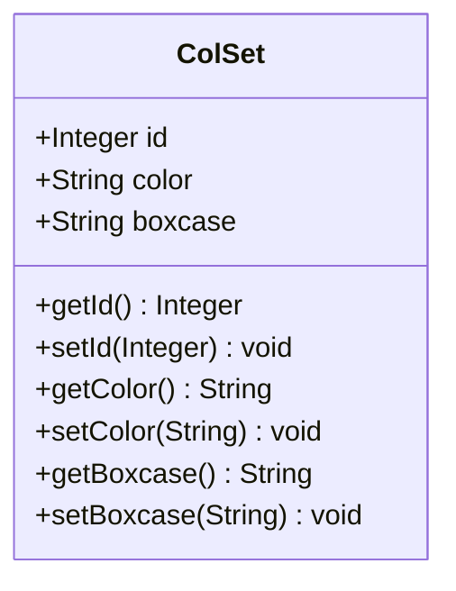

# Color Set Management - Technical Specification

## 1. Architecture & Service Layer

### 1.1 Component Overview

```text
┌─────────────────────────────────────────┐
│         CellControl (Controller)        │
│  @RequestMapping("/user")               │
├─────────────────────────────────────────┤
│  - getAllColSet()                       │
│  - addUser()                            │
│  - saveColSet()                         │
│  - modUser()                            │
│  - updateUser()                         │
│  - delUser()                            │
└──────────────┬──────────────────────────┘
               │ @Resource
               ▼
┌─────────────────────────────────────────┐
│      CellDaoImpl (DAO Implementation)   │
│  @Repository @Service                   │
│  @Transactional(propagation=SUPPORTS)   │
├─────────────────────────────────────────┤
│  - getAllCol(offset)                    │
│  - getColSetById(id)                    │
│  - getColSetByBoxcase(boxcase)          │
│  - saveOrUpdateColSet(colSet)           │
│  - delColSet(id)                        │
└──────────────┬──────────────────────────┘
               │ HibernateTemplate / JdbcTemplate
               ▼
┌─────────────────────────────────────────┐
│         Database (T_COLSET)             │
└─────────────────────────────────────────┘
```

### 1.2 Dependency Injection

| Bean | Type | Injection Method | Scope |
|------|------|-----------------|-------|
| cellDao | CellDao | @Resource | Singleton |
| vesselDao | VesselDao | @Resource | Singleton (not used in color-set APIs) |
| hibernateTemplate | HibernateTemplate | @Resource | Singleton |
| jdbcTemplate | JdbcTemplate | @Resource | Singleton |

### 1.3 Transaction Configuration

- **Propagation**: `SUPPORTS` — 方法在事务中执行则加入事务，否则非事务执行
- **隔离级别**: 使用数据库默认隔离级别
- **回滚策略**: 默认仅对 RuntimeException 及其子类回滚

> 📎 Source: src/main/java/com/springMVC/dao/CellDaoImpl.java → CellDaoImpl class annotation

## 2. API Contracts

### 2.1 GET /user/allColSet

**描述**: 分页查询颜色配置列表

**请求参数**:
| 参数名 | 类型 | 必填 | 说明 |
|-------|------|------|------|
| pager.offset | Integer | 否 | 分页偏移量，默认0 |

**响应**: ModelAndView 渲染 "colorManage" 视图
- Model 属性 `pm`: PageManage 对象
  - `total`: 总记录数
  - `datas`: List<ColSet> 当前页数据
  - `pagesize`: 10
  - `offset`: 当前偏移量

> 📎 Source: src/main/java/com/springMVC/control/CellControl.java → getAllColSet()

### 2.2 GET /user/addColor

**描述**: 打开新增颜色配置页面

**请求参数**: 无（通过 @ModelAttribute 绑定空 ColSet 对象）

**响应**: ModelAndView 渲染 "colSetDetail" 视图

> 📎 Source: src/main/java/com/springMVC/control/CellControl.java → addUser()

### 2.3 POST /user/saveColSet

**描述**: 保存新颜色配置

**请求参数** (form-urlencoded):
| 参数名 | 类型 | 必填 | 约束 |
|-------|------|------|------|
| boxcase | String | 是 | 最大长度10，唯一 |
| color | String | 是 | 最大长度15 |

**响应**:
- 成功: 重定向到 `/user/allColSet.html`
- 箱型重复: 返回 "colSetDetail" 视图，model 属性 `result` = "A boxcase with the same name already exists!"
- 保存失败: 返回 "saveColSet" 视图，model 属性 `result` = "The operation failed"

> 📎 Source: src/main/java/com/springMVC/control/CellControl.java → saveColSet()

### 2.4 GET /user/modifyColSet

**描述**: 打开修改颜色配置页面

**请求参数**:
| 参数名 | 类型 | 必填 | 说明 |
|-------|------|------|------|
| id | Integer | 是 | 配置ID（通过 @ModelAttribute 绑定） |

**响应**: ModelAndView 渲染 "updateColSet" 视图
- Model 属性 `col`: ColSet 对象（从数据库加载）

> 📎 Source: src/main/java/com/springMVC/control/CellControl.java → modUser()

### 2.5 POST /user/updateColSet

**描述**: 更新颜色配置

**请求参数** (form-urlencoded):
| 参数名 | 类型 | 必填 | 说明 |
|-------|------|------|------|
| id | Integer | 是 | 配置ID |
| color | String | 是 | 新颜色值 |

**响应**:
- 成功: 重定向到 `/user/allColSet.html`
- 失败: 返回 "updateColSet" 视图，model 属性 `result` = "The operation failed"

> 📎 Source: src/main/java/com/springMVC/control/CellControl.java → updateUser()

### 2.6 GET /user/delColSet

**描述**: 删除颜色配置

**请求参数**:
| 参数名 | 类型 | 必填 | 说明 |
|-------|------|------|------|
| id | Integer | 是 | 配置ID（通过 @ModelAttribute 绑定） |

**响应**: 重定向到 `/user/allColSet.html`

> 📎 Source: src/main/java/com/springMVC/control/CellControl.java → delUser()

## 3. Data Model

### 3.1 Entity: ColSet

**表名**: T_COLSET  
**序列**: colset_seq

| 列名 | Java 类型 | SQL 类型 | 约束 | 说明 |
|-----|----------|---------|------|------|
| colsetid | Integer | NUMBER | PK, NOT NULL | 主键，由序列生成 |
| BOXCASE | String | VARCHAR2(10) | NOT NULL | 箱型代码 |
| COLOR | String | VARCHAR2(15) | NOT NULL | 颜色值 |



> 📎 Source: src/main/java/com/springMVC/entity/ColSet.java → ColSet

### 3.2 Entity: PageManage

| 字段 | 类型 | 说明 |
|-----|------|------|
| datas | List | 当前页数据列表 |
| total | int | 总记录数 |
| pagesize | int | 每页大小（固定为10） |
| offset | int | 当前偏移量 |
| userid | int | 用户ID（未使用） |

> 📎 Source: src/main/java/com/springMVC/entity/PageManage.java → PageManage

## 4. Data Access Logic

### 4.1 Query: getAllCol(offset)

**HQL**: `from ColSet`  
**分页**: `setFirstResult(offset).setMaxResults(10)`  
**计数**: `select count(*) from ColSet`

**实现逻辑**:
1. 执行 COUNT 查询获取总记录数
2. 执行分页查询获取当前页数据
3. 封装为 PageManage 对象返回

> 📎 Source: src/main/java/com/springMVC/dao/CellDaoImpl.java → getAllCol()

### 4.2 Query: getColSetById(id)

**HQL**: `from ColSet c where c.id=?`

**注意**: 若 ID 不存在，`iterator().next()` 将抛出 NoSuchElementException

⚠️ [ERR:no-validation] getColSetById does not check if result is empty before calling iterator().next(), which will throw NoSuchElementException if no record found
> 📎 Source: src/main/java/com/springMVC/dao/CellDaoImpl.java → getColSetById()

### 4.3 Query: getColSetByBoxcase(boxcase)

**HQL**: `from ColSet c where c.boxcase=?`

**返回**: 若存在返回第一个匹配记录，否则返回 null

> 📎 Source: src/main/java/com/springMVC/dao/CellDaoImpl.java → getColSetByBoxcase()

### 4.4 Write: saveOrUpdateColSet(colSet)

**操作**: Hibernate `saveOrUpdate()`
- 若 id 为 null 或对应记录不存在：INSERT
- 若 id 存在：UPDATE

**异常处理**: 捕获所有异常，打印堆栈，返回 false

⚠️ [ERR:swallowed-exception] Exception is caught and printed but not re-thrown or logged properly; caller only receives boolean success flag without error details
> 📎 Source: src/main/java/com/springMVC/dao/CellDaoImpl.java → saveOrUpdateColSet()

### 4.5 Write: delColSet(id)

**操作**: 
1. 创建临时 ColSet 对象，仅设置 id
2. 调用 Hibernate `delete()`

**注意**: 若记录不存在，Hibernate 可能抛出异常

⚠️ [ERR:swallowed-exception] Exception is caught and printed but not re-thrown; caller receives false but no error context
> 📎 Source: src/main/java/com/springMVC/dao/CellDaoImpl.java → delColSet()

## 5. Business Logic

### 5.1 Uniqueness Validation (saveColSet)

**规则**: 新增前检查 boxcase 是否已存在

**实现**:
```java
if (cellDao.getColSetByBoxcase(boxcase) != null) {
    // 返回错误提示
}
```

> 📎 Source: src/main/java/com/springMVC/control/CellControl.java → saveColSet()

### 5.2 Update Logic (updateUser)

**流程**:
1. 根据 id 加载现有记录
2. 仅更新 color 字段
3. 调用 saveOrUpdateColSet 持久化

**注意**: 不校验 boxcase 是否被修改（因为表单只提交 color）

> 📎 Source: src/main/java/com/springMVC/control/CellControl.java → updateUser()

### 5.3 Pagination Handling

**Offset 解析**:
```java
try {
    offset = Integer.parseInt(request.getParameter("pager.offset"));
} catch (NumberFormatException ex) {
    // 静默处理，offset 保持为 0
}
```

**行为**: 非法 offset 值默认视为 0，展示第一页

> 📎 Source: src/main/java/com/springMVC/control/CellControl.java → getAllColSet()

## 6. Integration Points

本模块无外部系统集成。

## 7. Error Handling

### 7.1 Error Scenarios

| 场景 | 当前处理 | 风险等级 |
|-----|---------|---------|
| 数据库查询失败 (getAllCol) | 异常被捕获并打印堆栈，前端无提示 | ⚠️ 高 |
| 保存失败 (saveColSet) | 返回 "The operation failed" | 中 |
| 更新失败 (updateUser) | 返回 "The operation failed" | 中 |
| 删除失败 (delUser) | 异常被捕获并打印堆栈，仍重定向到列表页 | ⚠️ 高 |
| ID 不存在 (modifyColSet) | getColSetById 可能抛出 NoSuchElementException | ⚠️ 高 |
| ID 格式错误 (updateUser) | Integer.valueOf 可能抛出 NumberFormatException | ⚠️ 中 |

### 7.2 Risk Annotations

⚠️ [ERR:no-rollback] saveOrUpdateColSet and delColSet catch exceptions without transaction rollback guarantee; @Transactional(propagation=SUPPORTS) means no new transaction is created
> 📎 Source: src/main/java/com/springMVC/dao/CellDaoImpl.java → saveOrUpdateColSet(); delColSet()

⚠️ [ERR:swallowed-exception] getAllCol catches Exception but does not propagate error to frontend; user sees empty or stale data without knowing query failed
> 📎 Source: src/main/java/com/springMVC/control/CellControl.java → getAllColSet()

⚠️ [ERR:no-validation] delUser does not verify if the record exists before deletion; silent failure possible
> 📎 Source: src/main/java/com/springMVC/control/CellControl.java → delUser()

⚠️ [ERR:no-timeout] No timeout configuration for database queries; long-running queries may block threads indefinitely
> 📎 Source: src/main/java/com/springMVC/dao/CellDaoImpl.java → getAllCol()

## 8. Security

### 8.1 Authentication & Authorization

⚠️ [OWASP:A01] No authentication or authorization checks on any Color Set API endpoints; any authenticated user can perform CRUD operations
> 📎 Source: src/main/java/com/springMVC/control/CellControl.java → all methods

### 8.2 Input Validation

| 风险点 | 描述 | 缓解措施 |
|-------|------|---------|
| SQL Injection | 使用 Hibernate HQL 和参数化查询，风险较低 | ✅ 已使用参数化查询 |
| XSS | 颜色值和箱型代码直接渲染到视图，未做转义 | ⚠️ 需前端转义 |
| CSRF | 无 CSRF token 验证 | ⚠️ 缺失 |

⚠️ [OWASP:A03] No CSRF protection on POST endpoints (/user/saveColSet, /user/updateColSet); vulnerable to cross-site request forgery
> 📎 Source: src/main/java/com/springMVC/control/CellControl.java → saveColSet(); updateUser()

### 8.3 Data Access Scope

- 无行级权限控制
- 无租户隔离
- 所有用户可访问全部颜色配置

## 9. Performance

### 9.1 Query Optimization

| 查询 | 优化建议 |
|-----|---------|
| getAllCol | T_COLSET 表数据量通常较小，全表扫描可接受；建议添加 BOXCASE 唯一索引以加速唯一性校验 |
| getColSetByBoxcase | 依赖 BOXCASE 字段索引；若无索引则为全表扫描 |

⚠️ [PERF:no-index] No explicit index defined on T_COLSET.BOXCASE column; uniqueness validation query may perform full table scan as data grows
> 📎 Source: src/main/java/com/springMVC/dao/CellDaoImpl.java → getColSetByBoxcase()

### 9.2 Pagination Pattern

- 固定每页 10 条记录
- 使用 OFFSET/LIMIT 方式分页
- 无排序指定，返回顺序不确定

⚠️ [PERF:no-sort] getAllCol query has no ORDER BY clause; pagination results may be inconsistent across requests
> 📎 Source: src/main/java/com/springMVC/dao/CellDaoImpl.java → getAllCol()

### 9.3 Caching

- 无缓存机制
- 每次请求均查询数据库

对于低频访问的配置数据，可考虑引入应用层缓存（如 Ehcache）以减少数据库压力。
