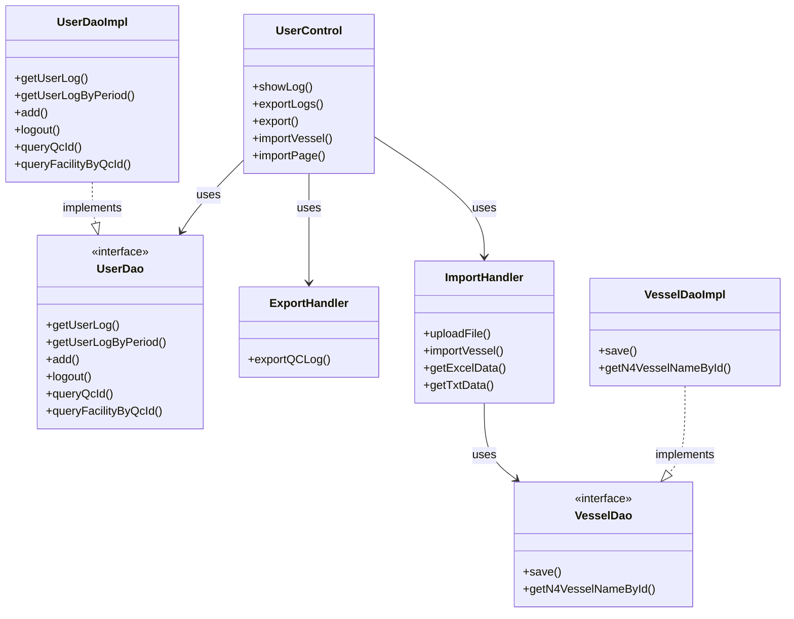
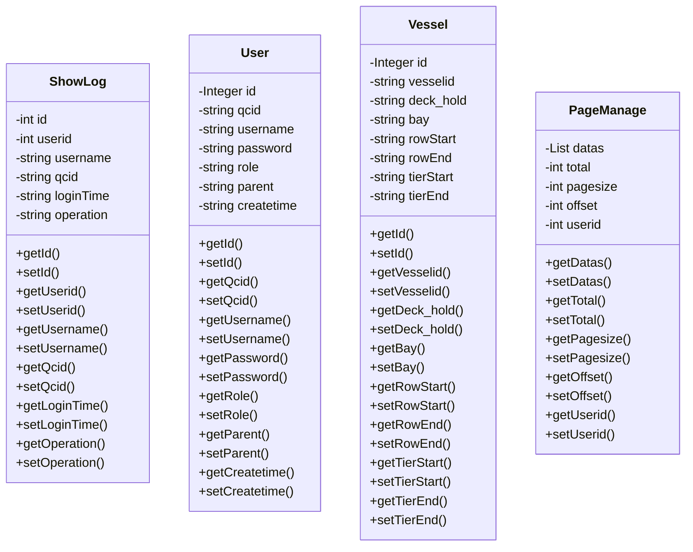

# Operation Log and Import/Export Module - Technical Specification

## 1. Architecture & Service Layer

### 1.1 Component Overview



### 1.2 Service Hierarchy

| Layer | Component | Technology |
|-------|-----------|------------|
| Controller | `UserControl` | Spring MVC `@Controller` |
| Service | `ExportHandler`, `ImportHandler` | Spring `@Service` |
| DAO Interface | `UserDao`, `VesselDao` | Plain Java Interface |
| DAO Implementation | `UserDaoImpl`, `VesselDaoImpl` | Spring `@Repository` + `@Service` |
| ORM | Hibernate 3 | `HibernateTemplate`, `JdbcTemplate` |

### 1.3 Dependency Injection

All dependencies are injected via `@Resource` annotation (JSR-250):
- `UserControl` injects: `UserDao`, `CellDao`, `ExportHandler`, `ImportHandler`
- `ImportHandler` injects: `VesselDao`, `JdbcTemplate`
- `UserDaoImpl` injects: `HibernateTemplate`, `JdbcTemplate`
- `VesselDaoImpl` injects: `HibernateTemplate`, `JdbcTemplate`

> 📎 Source: src/main/java/com/springMVC/control/UserControl.java → @Resource fields; src/main/java/com/springMVC/util/ImportHandler.java → @Resource fields; src/main/java/com/springMVC/dao/UserDaoImpl.java → @Resource fields

## 2. API Contracts

### 2.1 GET /user/log - View User Operation Log

**Request Parameters:**
| Parameter | Type | Required | Description |
|-----------|------|----------|-------------|
| `userid` | int | No | User ID to query logs for. Falls back to `user.id` from model attribute |
| `pager.offset` | int | No | Pagination offset, defaults to 0 |

**Response:** ModelAndView rendering `log.jsp` with `PageManage` object containing:
- `datas`: List of `ShowLog` entities (max 10 per page)
- `total`: Total count of logs in the last month
- `offset`: Current pagination offset
- `pagesize`: 10

> 📎 Source: src/main/java/com/springMVC/control/UserControl.java → showLog()

### 2.2 GET /user/exportLogs - Export Operation Logs

**Request Parameters:**
| Parameter | Type | Required | Description |
|-----------|------|----------|-------------|
| `fromTime` | String | Yes | Start time in `yyyy-MM-dd HH:mm:ss` format |
| `toTime` | String | Yes | End time in `yyyy-MM-dd HH:mm:ss` format |

**Response:** Binary Excel file download
- Content-Type: `bin`
- Filename: `{yyyyMMddHHmmss}.xls`
- Columns: 用户名, QC号码, 操作, 时间

> 📎 Source: src/main/java/com/springMVC/control/UserControl.java → exportLogs(); src/main/java/com/springMVC/util/ExportHandler.java → exportQCLog()

### 2.3 GET /user/export - Export Page

**Request Parameters:** None

**Response:** ModelAndView rendering `exportPage.jsp`

> 📎 Source: src/main/java/com/springMVC/control/UserControl.java → export()

### 2.4 POST /user/importVessel - Import Vessel Data

**Request:** Multipart form data with file upload

**Supported File Formats:** `.xls`, `.xlsx`, `.txt`

**Response:** 
- Success: ModelAndView rendering `importPage.jsp`
- Failure: ModelAndView with error message attribute `result`

**Error Messages:**
| Error Key | Condition |
|-----------|-----------|
| `error_no_vessel_found_in_n4` | Vessel ID not found in N4 system (TXT import only) |
| `import_vessel_file_empty` | Required columns missing in TXT file |
| `error_query_db_error` | General database or parsing error |

> 📎 Source: src/main/java/com/springMVC/control/UserControl.java → importVessel(); src/main/java/com/springMVC/util/ImportHandler.java → importVessel()

### 2.5 GET /user/importPage - Import Page

**Request Parameters:** None

**Response:** ModelAndView rendering `importPage.jsp`

> 📎 Source: src/main/java/com/springMVC/control/UserControl.java → importPage()

## 3. Data Model

### 3.1 Entity Classes

**T_SHOWLOG Table**
| Column | Type | Constraint | Description |
|--------|------|------------|-------------|
| userlogid | INT(7) | PK, Sequence: log_seq | Primary key |
| USERID | INT(7) | FK | Reference to T_USER.userid |
| USERNAME | VARCHAR(20) | | User name at time of operation |
| QCID | VARCHAR(20) | | QC number associated with the operation |
| LOGINTIME | VARCHAR(20) | | Operation timestamp in yyyyMMddHHmmss format |
| OPERATION | VARCHAR(15) | | Operation type: "LOGIN" or "LOGOUT" |

> 📎 Source: src/main/java/com/springMVC/entity/ShowLog.java → ShowLog

**T_USER Table**
| Column | Type | Constraint | Description |
|--------|------|------------|-------------|
| userid | INT(7) | PK, Sequence: user_seq | Primary key |
| QCID | VARCHAR(20) | | QC number assigned to user |
| NAME | VARCHAR(20) | | Username |
| PASSWORD | VARCHAR(6) | | Password (stored in plaintext) |
| ROLE | VARCHAR(10) | | Role: "ADMIN" or "USER" |
| PARENT | VARCHAR(10) | | Username of creator |
| CREATETIME | VARCHAR(14) | | Creation timestamp |

> 📎 Source: src/main/java/com/springMVC/entity/User.java → User

**T_VESSEL Table**
| Column | Type | Constraint | Description |
|--------|------|------------|-------------|
| vmid | INT | PK, Sequence: vessel_seq | Primary key |
| vesselid | VARCHAR(10) | | Vessel identifier from N4 |
| deck_hold | VARCHAR(10) | | Deck or hold indicator |
| bay | VARCHAR(10) | | Bay number |
| rowstart | VARCHAR(10) | | Minimum row number |
| rowend | VARCHAR(10) | | Maximum row number |
| tierstart | VARCHAR(10) | | Minimum tier number |
| tierend | VARCHAR(10) | | Maximum tier number |

> 📎 Source: src/main/java/com/springMVC/entity/Vessel.java → Vessel

### 3.2 Class Diagram



## 4. Data Access Logic

### 4.1 Query Conditions

**getUserLog(int id, int offset)** - Query user operation logs
- Filter: `userid = ? AND loginTime BETWEEN ? AND ?`
- Time range: Last month (`WebUtil.getPreMonthTime()` to `WebUtil.getTime()`)
- Sort: `loginTime DESC`
- Pagination: `setFirstResult(offset).setMaxResults(10)`

> 📎 Source: src/main/java/com/springMVC/dao/UserDaoImpl.java → getUserLog()

**getUserLogByPeriod(String fromTime, String toTime)** - Query logs by custom period
- Filter: `qcid IS NOT NULL AND loginTime BETWEEN ? AND ?`
- Time format conversion: Input `yyyy-MM-dd HH:mm:ss` → Internal `yyyyMMddHHmmss` via `WebUtil.DataFormatTransfer()`
- Sort: `loginTime DESC`
- No pagination (returns all matching records)

> 📎 Source: src/main/java/com/springMVC/dao/UserDaoImpl.java → getUserLogByPeriod()

**getAllUser(int offset)** - Query all users
- Sort: `username ASC`
- Pagination: `setFirstResult(offset).setMaxResults(10)`

> 📎 Source: src/main/java/com/springMVC/dao/UserDaoImpl.java → getAllUser()

### 4.2 Implicit Filters

| Filter | Applied In | Logic |
|--------|-----------|-------|
| Time window (last month) | `getUserLog()` | Automatically restricts to logs from past 30 days |
| QCID not null | `getUserLogByPeriod()` | Only exports logs with valid QC numbers |
| Soft delete cascade | `deleteById()` | When deleting a user, also deletes all their associated logs |

> 📎 Source: src/main/java/com/springMVC/dao/UserDaoImpl.java → deleteById()

### 4.3 Join Logic

**queryQcId()** - Query valid QC IDs from N4 system
```sql
SELECT DISTINCT xpow.name AS qcid 
FROM MN4O_QC_xps_pointofwork xpow 
WHERE xpow.yard IN (
    SELECT gkey FROM MN4O_QC_argo_yard 
    WHERE fcy_gkey IN (
        SELECT gkey FROM MN4O_QC_argo_facility 
        WHERE name IN ('{company}')
    )
)
```

> 📎 Source: src/main/java/com/springMVC/dao/UserDaoImpl.java → queryQcId()

**queryFacilityByQcId(String qcid)** - Query facility by QC ID
```sql
SELECT af.name AS facility 
FROM MN4O_QC_argo_facility af, MN4O_QC_argo_yard ay, MN4O_QC_xps_pointofwork xpow 
WHERE af.gkey = ay.fcy_gkey 
  AND xpow.yard = ay.gkey 
  AND xpow.name = ?
```

> 📎 Source: src/main/java/com/springMVC/dao/UserDaoImpl.java → queryFacilityByQcId()

**getN4VesselNameById(String vesselid)** - Query vessel name from N4
```sql
SELECT name FROM MN4O_QC_vsl_vessels WHERE id = ?
```

> 📎 Source: src/main/java/com/springMVC/dao/VesselDaoImpl.java → getN4VesselNameById()

## 5. Business Logic

### 5.1 Login Flow

1. Validate QC number for USER role against N4 system
2. Query user by username and password (plaintext comparison)
3. Verify role matches selected role
4. Create ShowLog entry with operation="LOGIN"
5. Set session attributes: `Constants.USER_LOGIN`, `Constants.QC_ID`
6. Update cookies for default QC/HC/C numbers

⚠️ [OWASP:A02] Password stored and compared in plaintext without hashing
> 📎 Source: src/main/java/com/springMVC/dao/UserDaoImpl.java → login()

⚠️ [OWASP:A07] No rate limiting or account lockout mechanism for failed login attempts
> 📎 Source: src/main/java/com/springMVC/control/UserControl.java → login()

### 5.2 Logout Flow

1. Retrieve user from session
2. Determine QCID based on role (empty for ADMIN, session QC_ID for USER)
3. Create ShowLog entry with operation="LOGOUT"
4. Return "yes" on success, "no" on exception

> 📎 Source: src/main/java/com/springMVC/dao/UserDaoImpl.java → logout()

### 5.3 Vessel Import Logic (TXT Format)

**Parsing Steps:**
1. Extract vessel ID from `*SHIP` section using regex `\*SHIP\r\n.*\r\n(.*?)\t`
2. Parse bay plan header and rows from `*STACK` section
3. Parse custom tier data from `*TIER` section (optional)
4. Map column indices for: STAF BAY, LEVEL, ISO STACK, TOP TIER, BOTTOM TIER
5. Aggregate rows by Bay+Level combination:
   - rowStart = min(ISO STACK)
   - rowEnd = max(ISO STACK)
   - tierStart = min(BOTTOM TIER)
   - tierEnd = max(TOP TIER)
6. Override tier values with custom tier data if present
7. Validate vessel ID exists in N4 system
8. Save each aggregated record to database

> 📎 Source: src/main/java/com/springMVC/util/ImportHandler.java → getTxtData()

### 5.4 Vessel Import Logic (Excel Format)

1. Read first sheet, skip header row (ignoreRows=1)
2. For each cell, handle types: STRING, NUMERIC (formatted as integer), FORMULA, BOOLEAN, BLANK, ERROR
3. Skip rows where first column is empty
4. Map columns 0-6 to: vesselid, deck_hold, bay, rowStart, rowEnd, tierStart, tierEnd
5. Call `VesselDao.save()` which performs upsert (insert if new, update if exists by vesselid+deck_hold+bay)

> 📎 Source: src/main/java/com/springMVC/util/ImportHandler.java → getExcelData(); src/main/java/com/springMVC/dao/VesselDaoImpl.java → save()

### 5.5 Default Value Rules

| Field | Default Value | Source |
|-------|--------------|--------|
| ShowLog.operation | "LOGIN" or "LOGOUT" | Hardcoded in controller/DAO |
| ShowLog.loginTime | `WebUtil.getTime()` (yyyyMMddHHmmss) | Utility method |
| User.createtime | `WebUtil.getTime()` | Controller save method |
| User.parent | Current logged-in user's username | From session attribute |

> 📎 Source: src/main/java/com/springMVC/control/UserControl.java → login(), save(); src/main/java/com/springMVC/dao/UserDaoImpl.java → logout()

## 6. Integration Points

### 6.1 N4 Database Integration

| Integration | Protocol | Query Method | Timeout | Retry |
|------------|----------|--------------|---------|-------|
| QC ID validation | JDBC | Direct SQL query | Default JDBC timeout | None |
| Facility lookup | JDBC | Direct SQL query | Default JDBC timeout | None |
| Vessel name lookup | JDBC | Direct SQL query | Default JDBC timeout | None |

⚠️ [ERR:no-timeout] No explicit timeout configuration for JDBC queries to N4 database
> 📎 Source: src/main/java/com/springMVC/dao/UserDaoImpl.java → queryQcId(), queryFacilityByQcId(); src/main/java/com/springMVC/dao/VesselDaoImpl.java → getN4VesselNameById()

### 6.2 File Upload Configuration

- Upload folder path: Configured via `PropertiesUtil.getPropertiesValue("uploadFolder")`
- Memory threshold: 1 MB (`factory.setSizeThreshold(1024 * 1024 * 1)`)
- Temporary storage: Repository set to upload folder

> 📎 Source: src/main/java/com/springMVC/util/ImportHandler.java → uploadFile()

## 7. Error Handling

### 7.1 Error Scenarios

| Scenario | Error Code | Handling Strategy |
|----------|-----------|-------------------|
| Database connection failure during login | `error_db_not_connected` | Display error message, return to login page |
| Invalid username/password | `error_nampass_incorrect` | Display error message, return to login page |
| Role mismatch | `error_user_or_admin` | Display error message, return to login page |
| Invalid QC number | `error_check_qc_number` | Display error message, return to login page |
| Username already exists | `error_username_exists` | Display result message on user detail page |
| User creation failure | `error_can_not_add_user` | Display result message on user detail page |
| User update failure | `error_can_not_update_user` | Redirect to modify page with result message |
| Session expired during logout | `error_webpage_expired` | Display message, redirect to login |
| Vessel not found in N4 | `error_no_vessel_found_in_n4` | Throw GeneralException, display error on import page |
| Missing required columns in TXT | `import_vessel_file_empty` | Throw GeneralException, display error on import page |
| General import error | `error_query_db_error` | Throw GeneralException, display generic error |

### 7.2 Exception Handling Patterns

⚠️ [ERR:swallowed-exception] Multiple catch blocks print stack trace but do not propagate or log properly
> 📎 Source: src/main/java/com/springMVC/control/UserControl.java → login() line 158-168, delUser() line 392-396, showLog() line 469-471

⚠️ [ERR:no-rollback] File upload exceptions are caught and logged but uploaded file may remain on disk
> 📎 Source: src/main/java/com/springMVC/util/ImportHandler.java → uploadFile() line 126-129

### 7.3 Transaction Management

- `@Transactional(propagation = Propagation.REQUIRED)` used for write operations: `save()`, `deleteById()`, `update()`, `add()`
- `@Transactional(propagation = Propagation.SUPPORTS)` used at class level for read operations

> 📎 Source: src/main/java/com/springMVC/dao/UserDaoImpl.java → class-level annotation; src/main/java/com/springMVC/dao/VesselDaoImpl.java → class-level annotation

## 8. Security

### 8.1 Authentication

- Username/password authentication with plaintext storage
- Session-based authentication using `Constants.USER_LOGIN` attribute
- No password encryption or hashing implemented

⚠️ [OWASP:A02] Passwords stored in plaintext in database (VARCHAR(6) suggests very short passwords)
> 📎 Source: src/main/java/com/springMVC/entity/User.java → password field; src/main/java/com/springMVC/dao/UserDaoImpl.java → login()

### 8.2 Authorization

- Role-based access: ADMIN vs USER
- ADMIN role bypasses QC number validation
- No method-level security annotations (e.g., @PreAuthorize)

⚠️ [OWASP:A01] No authorization checks on API endpoints beyond session presence
> 📎 Source: src/main/java/com/springMVC/control/UserControl.java → All endpoints lack @PreAuthorize or similar annotations

### 8.3 Data Access Scope

- Users can view any other user's logs by passing userid parameter
- No row-level security filtering on log queries

⚠️ [OWASP:A01] Any authenticated user can view another user's operation logs by manipulating userid parameter
> 📎 Source: src/main/java/com/springMVC/control/UserControl.java → showLog() line 452-458

### 8.4 SQL Injection Risk

- Most queries use parameterized HQL/JDBC queries (safe)
- However, `queryQcId()` uses string concatenation for company name

⚠️ [OWASP:A03] Dynamic SQL construction with string concatenation in queryQcId()
> 📎 Source: src/main/java/com/springMVC/dao/UserDaoImpl.java → queryQcId() line 209-212

### 8.5 File Upload Security

- No file type validation beyond extension check
- No file size limit enforcement
- No path traversal protection on uploaded filename

⚠️ [OWASP:A03] File upload accepts any file with .xls/.xlsx/.txt extension without content validation
> 📎 Source: src/main/java/com/springMVC/util/ImportHandler.java → uploadFile() line 101

## 9. Performance

### 9.1 Query Optimization

**Pagination Pattern:**
- All list queries use `setFirstResult(offset).setMaxResults(10)` for consistent pagination
- Count queries executed separately before data queries

⚠️ [PERF:n+1] getUserLog executes count query and data query separately, potentially causing redundant database round trips
> 📎 Source: src/main/java/com/springMVC/dao/UserDaoImpl.java → getUserLog() line 140-141

**Missing Indexes:**
- T_SHOWLOG table likely needs composite index on (userid, loginTime) for efficient log queries
- T_USER table likely needs index on username for login lookups

⚠️ [PERF:no-index] No visible index definitions in entity classes; dependent on database schema for performance
> 📎 Source: src/main/java/com/springMVC/entity/ShowLog.java; src/main/java/com/springMVC/entity/User.java

### 9.2 Batch Processing

- Vessel import processes rows one-by-one in a loop calling `vesselDao.save()`
- Each save triggers a database query to check for existing records

⚠️ [PERF:large-batch] Vessel import processes records individually without batch insert optimization
> 📎 Source: src/main/java/com/springMVC/util/ImportHandler.java → importVessel() line 149-173

### 9.3 Caching

- No caching layer implemented
- Cookie-based storage for default QC/HC/C numbers (client-side only)
- Repeated N4 queries for same QC IDs not cached

⚠️ [PERF:no-cache] No server-side caching for frequently accessed data like QC ID lists or facility mappings
> 📎 Source: src/main/java/com/springMVC/dao/UserDaoImpl.java → queryQcId()

### 9.4 Export Performance

- Export loads all matching records into memory before generating Excel
- No streaming or chunked export for large datasets

⚠️ [PERF:no-pagination] Export endpoint loads all records into memory without pagination, risking OOM for large datasets
> 📎 Source: src/main/java/com/springMVC/dao/UserDaoImpl.java → getUserLogByPeriod() line 175