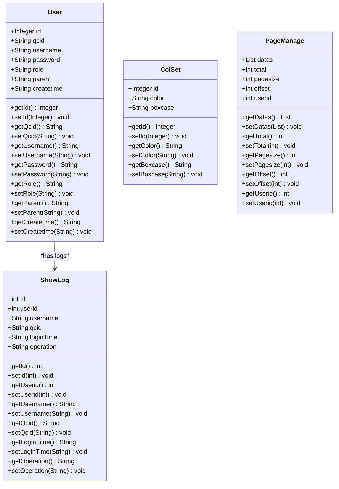

# User Management Module - Technical Specification

## 1. Architecture & Service Layer

### 1.1 Component Overview

The User Management module follows a traditional Spring MVC layered architecture:

```
Controller Layer (UserControl)
    ↓
Service/DAO Layer (UserDao, CellDao)
    ↓
Data Access Layer (HibernateTemplate, JdbcTemplate)
    ↓
Database (T_USER, T_SHOWLOG, T_COLSET)
```

**Key Components:**

| Component | Type | Responsibility |
|-----------|------|----------------|
| `UserControl` | Controller | Handle HTTP requests, session management, view rendering |
| `UserDao` | Interface | Define data access operations for users and logs |
| `UserDaoImpl` | Repository | Implement user CRUD, login validation, log recording |
| `CellDao` | Interface | Access color configuration data from external module |
| `ExportHandler` | Service | Export operation logs to Excel format |
| `ImportHandler` | Service | Import vessel configuration from Excel/TXT files |
| `CookiesUtil` | Utility | Manage browser cookies for QC number preferences |
| `MessageUtil` | Utility | Retrieve i18n messages based on session locale |

> 📎 Source: src/main/java/com/springMVC/control/UserControl.java → UserControl; src/main/java/com/springMVC/dao/UserDaoImpl.java → UserDaoImpl

### 1.2 Dependency Injection

All dependencies are injected via Spring's `@Resource` annotation:

```java
@Resource
private UserDao userDao;

@Resource
private CellDao cellDao;

@Resource
private ExportHandler exportHandler;

@Resource
private ImportHandler importHandler;
```

In `UserDaoImpl`, both Hibernate and JDBC templates are injected:

```java
@Resource
private HibernateTemplate hibernateTemplate;

@Resource
private JdbcTemplate jdbcTemplate;
```

> 📎 Source: src/main/java/com/springMVC/control/UserControl.java → field declarations; src/main/java/com/springMVC/dao/UserDaoImpl.java → field declarations

### 1.3 Transaction Management

- **Read operations**: `@Transactional(propagation = Propagation.SUPPORTS)` at class level
- **Write operations**: `@Transactional(propagation = Propagation.REQUIRED)` on specific methods:
  - `save()` - Create user
  - `deleteById()` - Delete user and associated logs
  - `update()` - Update user
  - `add()` - Add operation log

> 📎 Source: src/main/java/com/springMVC/dao/UserDaoImpl.java → @Transactional annotations

## 2. API Contracts

### 2.1 Login Endpoints

#### POST /user/login

**Request Parameters (Form Data):**
| Parameter | Type | Required | Description |
|-----------|------|----------|-------------|
| username | String | Yes | Username (max 20 chars) |
| password | String | Yes | Password (max 6 chars) |
| label | String | Yes | Role: "USER" or "ADMIN" |
| qc | String | Conditional | QC number (required for USER role) |
| hc | String | Conditional | HC number (alternative to qc) |
| c | String | Conditional | C number (fallback if qc/hc not provided) |

**Response:**
- Success (USER): Redirect to `/tqcvmt` with model attributes: `u` (User object), facility info, color configurations
- Success (ADMIN): Redirect to `/user/all.html`
- Failure: Return to login page with error message in `msg` attribute

**Error Messages:**
- `error_nampass_incorrect`: Invalid username or password
- `error_check_qc_number`: QC number not found in N4 system
- `error_user_or_admin`: Role mismatch
- `error_db_not_connected`: Database connection failure

> 📎 Source: src/main/java/com/springMVC/control/UserControl.java → login(HttpServletRequest, ModelMap, HttpServletResponse)

#### POST /user/loginAdmin

**Request Parameters (Form Data):**
| Parameter | Type | Required | Description |
|-----------|------|----------|-------------|
| username | String | Yes | Username |
| password | String | Yes | Password |
| label | String | Yes | Must be "ADMIN" |
| lan | String | No | Language preference |

**Response:**
- Success: Redirect to `/user/all.html`
- Failure: Return to `loginAdmin` view with error message

> 📎 Source: src/main/java/com/springMVC/control/UserControl.java → loginAdmin()

### 2.2 User Management Endpoints

#### GET /user/add

**Purpose:** Display user creation form

**Response:** Render `userDetail` view with empty form

> 📎 Source: src/main/java/com/springMVC/control/UserControl.java → addUser()

#### POST /user/save

**Request Parameters (Form Data):**
| Parameter | Type | Required | Description |
|-----------|------|----------|-------------|
| username | String | Yes | New username |
| password | String | Yes | Password |
| role | String | Yes | "USER" or "ADMIN" |
| qcid | String | Yes | QC ID |

**Response:**
- Success: Redirect to `/user/all.html`
- Failure (username exists): Return to `userDetail` with `result` error message
- Failure (DB error): Return to `userDetail` with `error_can_not_add_user` message

> 📎 Source: src/main/java/com/springMVC/control/UserControl.java → add()

#### GET /user/all

**Request Parameters:**
| Parameter | Type | Required | Description |
|-----------|------|----------|-------------|
| pager.offset | Integer | No | Pagination offset (default: 0) |

**Response:** Render `admin` view with:
- `pm`: PageManage object containing user list (10 per page)
- `limit`: "Yes" if current user is in limitAccount list

> 📎 Source: src/main/java/com/springMVC/control/UserControl.java → listAllUser()

#### GET /user/del

**Request Parameters:**
| Parameter | Type | Required | Description |
|-----------|------|----------|-------------|
| id | Integer | Yes | User ID (via @ModelAttribute) |

**Response:** Redirect to `/user/all.html`

⚠️ [ERR:swallowed-exception] Exception during deletion is caught and only printed to stack trace without user feedback
> 📎 Source: src/main/java/com/springMVC/control/UserControl.java → delUser()

#### GET /user/modify

**Request Parameters:**
| Parameter | Type | Required | Description |
|-----------|------|----------|-------------|
| id | Integer | Yes | User ID (via @ModelAttribute) |
| result | String | No | Previous operation result message |

**Response:** Render `update` view with user data and optional result message

> 📎 Source: src/main/java/com/springMVC/control/UserControl.java → modUser()

#### POST /user/update

**Request Parameters (Form Data):**
| Parameter | Type | Required | Description |
|-----------|------|----------|-------------|
| u_id | String | Yes | User ID |
| password | String | Yes | New password |
| role | String | Yes | New role |
| qcid | String | Yes | New QC ID |

**Response:**
- Success: Redirect to `/user/all.html`
- Failure: Redirect to `/user/modify.html` with error message

> 📎 Source: src/main/java/com/springMVC/control/UserControl.java → updateUser()

### 2.3 Log Management Endpoints

#### GET /user/log

**Request Parameters:**
| Parameter | Type | Required | Description |
|-----------|------|----------|-------------|
| userid | Integer | Conditional | User ID (if not in @ModelAttribute) |
| pager.offset | Integer | No | Pagination offset |

**Response:** Render `log` view with PageManage containing last month's logs (10 per page)

> 📎 Source: src/main/java/com/springMVC/control/UserControl.java → showLog()

#### GET /user/exportLogs

**Request Parameters:**
| Parameter | Type | Required | Description |
|-----------|------|----------|-------------|
| fromTime | String | Yes | Start time (format: yyyy-MM-dd HH:mm:ss) |
| toTime | String | Yes | End time (format: yyyy-MM-dd HH:mm:ss) |

**Response:** Binary Excel file download with filename `yyyyMMddHHmmss.xls`

**Excel Columns:** 用户名, QC号码, 操作, 时间

> 📎 Source: src/main/java/com/springMVC/util/ExportHandler.java → exportQCLog()

### 2.4 Import/Export Endpoints

#### GET /user/importPage

**Response:** Render `importPage` view

> 📎 Source: src/main/java/com/springMVC/control/UserControl.java → importPage()

#### POST /user/importVessel

**Request:** Multipart form with file upload

**Supported Formats:** .xls, .xlsx, .txt

**Response:**
- Success: Render `importPage` view
- Failure: Render `importPage` with error message (`error_no_vessel_found_in_n4` or `import_vessel_file_empty`)

> 📎 Source: src/main/java/com/springMVC/control/UserControl.java → importVessel()

### 2.5 Utility Endpoints

#### GET /user/index

**Request Parameters:**
| Parameter | Type | Required | Description |
|-----------|------|----------|-------------|
| url | String | No | If "admin", show admin login page |
| local | String | No | Locale parameter (unused in this method) |

**Response:** Render `login` or `loginAdmin` view with cookie values for defQCNUM, defHCNUM, defCNUM

> 📎 Source: src/main/java/com/springMVC/control/UserControl.java → index()

#### GET /user/changeLan

**Request Parameters:**
| Parameter | Type | Required | Description |
|-----------|------|----------|-------------|
| local | String | Yes | "zh_CN", "zh_TW", or "en" |
| label | String | No | "ADMIN" to mark admin context |
| url | String | No | If "admin", show admin login page |

**Response:** Set session locale and render appropriate login view

> 📎 Source: src/main/java/com/springMVC/control/UserControl.java → changeLan()

#### GET /user/logout

**Response:**
- Record logout log
- Clear session
- Redirect to `/user/index.html?url=admin` (if admin) or `/user/index.html` (if user)
- Show `error_webpage_expired` message if logout fails

> 📎 Source: src/main/java/com/springMVC/control/UserControl.java → logout()

## 3. Data Model

### 3.1 Entity Classes



### 3.2 Database Schema

#### T_USER Table

| Column | Type | Constraint | Description |
|--------|------|------------|-------------|
| userid | INTEGER | PK, Sequence (user_seq) | User ID |
| NAME | VARCHAR(20) | NOT NULL | Username |
| PASSWORD | VARCHAR(6) | NOT NULL | Password (⚠️ short length) |
| ROLE | VARCHAR(10) | NOT NULL | USER or ADMIN |
| QCID | VARCHAR(20) | NULL | QC number for USER role |
| PARENT | VARCHAR(10) | NULL | Creator username |
| CREATETIME | VARCHAR(14) | NULL | Creation timestamp (yyyyMMddHHmmss) |

> 📎 Source: src/main/java/com/springMVC/entity/User.java → @Table, @Column annotations

#### T_SHOWLOG Table

| Column | Type | Constraint | Description |
|--------|------|------------|-------------|
| userlogid | INTEGER | PK, Sequence (log_seq) | Log ID |
| USERID | INTEGER | NOT NULL | Reference to T_USER.userid |
| USERNAME | VARCHAR(20) | NOT NULL | Username (denormalized) |
| QCID | VARCHAR(20) | NULL | QC number |
| LOGINTIME | VARCHAR(20) | NOT NULL | Operation timestamp (yyyyMMddHHmmss) |
| OPERATION | VARCHAR(15) | NOT NULL | LOGIN or LOGOUT |

> 📎 Source: src/main/java/com/springMVC/entity/ShowLog.java → @Table, @Column annotations

#### T_COLSET Table

| Column | Type | Constraint | Description |
|--------|------|------------|-------------|
| colsetid | INTEGER | PK, Sequence (colset_seq) | Configuration ID |
| COLOR | VARCHAR(15) | NOT NULL | Color value |
| BOXCASE | VARCHAR(10) | NOT NULL | Box case code |

> 📎 Source: src/main/java/com/springMVC/entity/ColSet.java → @Table, @Column annotations

## 4. Data Access Logic

### 4.1 Query Conditions

#### User Login Query
```sql
-- HQL: from User WHERE username=? and password=? order by username
SELECT * FROM T_USER 
WHERE NAME = ? AND PASSWORD = ? 
ORDER BY NAME
```
- Returns first matching user or null
- ⚠️ [OWASP:A02] Password stored in plaintext, no hashing applied
> 📎 Source: src/main/java/com/springMVC/dao/UserDaoImpl.java → login()

#### Get All Users (Paginated)
```sql
-- Count query
SELECT COUNT(*) FROM T_USER ORDER BY NAME

-- Data query (paginated)
SELECT * FROM T_USER 
ORDER BY NAME 
LIMIT 10 OFFSET ?
```
- Fixed page size: 10 records
- Offset controlled by request parameter

> 📎 Source: src/main/java/com/springMVC/dao/UserDaoImpl.java → getAllUser()

#### Get User Logs (Last Month)
```sql
-- Count query
SELECT COUNT(*) FROM T_SHOWLOG 
WHERE userid = ? 
AND (LOGINTIME BETWEEN ? AND ?) 
ORDER BY LOGINTIME DESC

-- Data query (paginated)
SELECT * FROM T_SHOWLOG 
WHERE userid = ? 
AND (LOGINTIME BETWEEN ? AND ?) 
ORDER BY LOGINTIME DESC
LIMIT 10 OFFSET ?
```
- Time range: from one month ago to current time
- Parameters: userid, startTime (yyyyMMddHHmmss), endTime (yyyyMMddHHmmss)

> 📎 Source: src/main/java/com/springMVC/dao/UserDaoImpl.java → getUserLog()

#### Export Logs by Period
```sql
SELECT * FROM T_SHOWLOG 
WHERE qcid IS NOT NULL 
AND (LOGINTIME BETWEEN ? AND ?) 
ORDER BY LOGINTIME DESC
```
- Filters out logs without QC ID
- No pagination (exports all matching records)
- Time format conversion applied via `WebUtil.DataFormatTransfer()`

> 📎 Source: src/main/java/com/springMVC/dao/UserDaoImpl.java → getUserLogByPeriod()

#### Query QC IDs from N4 System
```sql
SELECT DISTINCT xpow.name AS qcid 
FROM MN4O_QC_xps_pointofwork xpow 
WHERE xpow.yard IN (
    SELECT gkey FROM MN4O_QC_argo_yard 
    WHERE fcy_gkey IN (
        SELECT gkey FROM MN4O_QC_argo_facility 
        WHERE name IN ('{company}')
    )
)
```
- Uses JdbcTemplate for direct SQL execution
- Company name injected from properties configuration
- ⚠️ [OWASP:A03] SQL injection risk: company value concatenated directly into query string without parameterization
> 📎 Source: src/main/java/com/springMVC/dao/UserDaoImpl.java → queryQcId()

#### Query Facility by QC ID
```sql
SELECT af.name AS facility 
FROM MN4O_QC_argo_facility af, MN4O_QC_argo_yard ay, MN4O_QC_xps_pointofwork xpow 
WHERE af.gkey = ay.fcy_gkey 
AND xpow.yard = ay.gkey 
AND xpow.name = ?
```
- Uses parameterized query (safe from SQL injection)
- Three-table join to resolve facility name from QC ID

> 📎 Source: src/main/java/com/springMVC/dao/UserDaoImpl.java → queryFacilityByQcId()

### 4.2 Filter Rules

#### Implicit Filters
- **Soft delete**: Not implemented; users are physically deleted
- **Tenant isolation**: Not implemented; all users share same namespace
- **QC-based filtering**: USER role users must have valid QC ID from N4 system

#### Sorting Rules
- Users: Always sorted by username ascending
- Logs: Always sorted by loginTime descending (newest first)

### 4.3 Join Logic

- **User deletion cascade**: When deleting a user, all associated ShowLog records are also deleted
  ```java
  // First delete user
  hibernateTemplate.delete(user);
  // Then delete associated logs
  List list = hibernateTemplate.find("from ShowLog where userid=?", id);
  hibernateTemplate.deleteAll(list);
  ```
  ⚠️ [ERR:no-rollback] Two separate delete operations without transaction rollback guarantee if second fails
  > 📎 Source: src/main/java/com/springMVC/dao/UserDaoImpl.java → deleteById()

## 5. Business Logic

### 5.1 Calculation Rules

#### QC ID Construction Logic
```java
String qcid = "".equals(idQc) 
    ? ("".equals(idHc) ? "C" + idC : "HC" + idHc) 
    : "QC" + idQc;
```
Priority: QC > HC > C

For ADMIN role, qcid is set to empty string.

> 📎 Source: src/main/java/com/springMVC/control/UserControl.java → login() line 117

#### Time Format Conversion
- Internal format: `yyyyMMddHHmmss` (14 digits)
- Display format: `yyyy-MM-dd HH:mm:ss`
- Conversion method: `WebUtil.DataFormatTransfer()`

> 📎 Source: src/main/java/com/springMVC/util/WebUtil.java → DataFormatTransfer()

### 5.2 State Transition Rules

#### Login State Machine
```
[Login Page] --valid credentials--> [Session Created] --role check--> [Redirect]
     |                                    |                    |
     |--invalid credentials--> [Error Message]                  |--ADMIN--> [/user/all.html]
     |--QC validation fail--> [Error Message]                   |--USER--> [/tqcvmt]
```

Preconditions:
- Username and password must match database record
- For USER role: QC ID must exist in N4 system
- Selected role must match stored role

> 📎 Source: src/main/java/com/springMVC/control/UserControl.java → login()

### 5.3 Default Value Rules

#### User Creation Defaults
- `createtime`: Current timestamp via `WebUtil.getTime()`
- `parent`: Current logged-in user's username from session

> 📎 Source: src/main/java/com/springMVC/control/UserControl.java → add() lines 344-351

#### Cookie Defaults
- Cookie keys: defQCNUM, defHCNUM, defCNUM
- Initial value: Empty string if cookie doesn't exist
- Max age: Configured via `cookieMaxAge` property

> 📎 Source: src/main/java/com/springMVC/util/CookiesUtil.java → cookieMaxAge

### 5.4 Permission Filtering Rules

#### Role-Based Access Control
- Implemented at controller level via manual checks
- No declarative security annotations (@PreAuthorize, etc.)
- ⚠️ [OWASP:A01] No authentication/authorization framework integration; relies on session attribute checks
> 📎 Source: src/main/java/com/springMVC/control/UserControl.java → all handler methods

#### Limit Account Check
```java
String limitAccountStr = PropertiesUtil.getPropertiesValue("limitAccount");
for (String temp : limitAccountStr.split(",")) {
    if (StringUtils.equals(temp, user.getUsername())) {
        model.put("limit", "Yes");
    }
}
```
- Comma-separated list from properties file
- Used to flag restricted accounts in UI

> 📎 Source: src/main/java/com/springMVC/control/UserControl.java → listAllUser()

## 6. Integration Points

### 6.1 N4 System Integration

**Protocol:** Direct JDBC database queries

**Endpoints:**
1. **QC ID Validation** (`queryQcId()`)
   - Tables: `MN4O_QC_xps_pointofwork`, `MN4O_QC_argo_yard`, `MN4O_QC_argo_facility`
   - Purpose: Validate QC numbers during user login
   - Timeout: None configured
   - Retry: None configured
   
2. **Facility Lookup** (`queryFacilityByQcId()`)
   - Same tables as above
   - Purpose: Get facility name for display
   - Parameterized query (safe)

**Error Handling:**
- Connection failures caught and return empty list or null
- Error message: `error_db_not_connected`

⚠️ [PERF:blocking-io] Synchronous database calls to external N4 system block request thread during login
> 📎 Source: src/main/java/com/springMVC/dao/UserDaoImpl.java → queryQcId(), queryFacilityByQcId()

### 6.2 Color Set Module Integration

**Interface:** `CellDao.getColSet()`

**Purpose:** Load color configurations for UI customization

**Trigger:** After successful USER login

**Data Flow:**
```
UserControl.login() → CellDao.getColSet() → List<ColSet> → Model attributes
```

Each ColSet maps boxcase to color, added to model as individual attributes.

> 📎 Source: src/main/java/com/springMVC/control/UserControl.java → login() lines 202-207

### 6.3 File Import Integration

**Upload Handler:** `ImportHandler.uploadFile()`
- Uses Apache Commons FileUpload
- Temporary storage in configured `uploadFolder`
- Memory threshold: 1MB

**Import Processor:** `ImportHandler.importVessel()`
- Supports .xls, .xlsx, .txt formats
- Validates vessel existence in N4 system via `VesselDao.getN4VesselNameById()`
- Parses bay plan data from file content

⚠️ [OWASP:A03] File upload without extension whitelist validation; relies on runtime parsing
> 📎 Source: src/main/java/com/springMVC/util/ImportHandler.java → uploadFile(), importVessel()

## 7. Error Handling

### 7.1 Error Codes and Messages

| Error Code | Message Key | Context |
|------------|-------------|---------|
| error_nampass_incorrect | The username or password is incorrect! | Login failure |
| error_username_empty | The username cannot be empty! | Validation |
| error_password_empty | The password cannot be empty! | Validation |
| error_check_qc_number | There's no this QC number, please check! | QC validation |
| error_user_or_admin | Please confirm whether the user or administrator! | Role mismatch |
| error_db_not_connected | Database cannot be connected! | DB connection failure |
| error_username_exists | The username already exists! | User creation |
| error_can_not_add_user | Sorry, it can't add user! | User creation DB error |
| error_can_not_update_user | Sorry, it cannot update the user! | User update DB error |
| error_webpage_expired | Webpage expired, please login again! | Logout/session expiry |
| error_no_vessel_found_in_n4 | No such vessel found in N4 | Vessel import |
| import_vessel_file_empty | Please check whether file content is ok or content repetition | File import |

### 7.2 Exception Scenarios

#### Login Exceptions
- Database connection failure: Caught, shows `error_db_not_connected`, returns to login page
- General exception: Caught at top level, shows `error_db_not_connected`

⚠️ [ERR:swallowed-exception] Generic catch-all blocks print stack trace but don't log properly or provide meaningful recovery
> 📎 Source: src/main/java/com/springMVC/control/UserControl.java → login() lines 158-168, 247-250

#### User Deletion Exceptions
- Exception caught and only printed to stack trace
- No user feedback on failure
- Redirect still occurs even if deletion failed

⚠️ [ERR:swallowed-exception] Silent failure on user deletion with no rollback or user notification
> 📎 Source: src/main/java/com/springMVC/control/UserControl.java → delUser() lines 392-396

#### Update Exceptions
- Caught and returns to modify page with error message
- Proper error handling with user feedback

> 📎 Source: src/main/java/com/springMVC/control/UserControl.java → updateUser() lines 437-440

### 7.3 Rollback Strategies

- **Transactional methods**: `save()`, `deleteById()`, `update()`, `add()` use `Propagation.REQUIRED`
- **Non-transactional reads**: Use `Propagation.SUPPORTS`
- **Cascading deletes**: User deletion includes log deletion, but not atomic (two separate operations)

⚠️ [ERR:no-rollback] Cascading delete in deleteById() performs two separate delete operations; if second fails, user is already deleted but logs remain
> 📎 Source: src/main/java/com/springMVC/dao/UserDaoImpl.java → deleteById()

## 8. Security

### 8.1 Authentication Requirements

- **No authentication framework**: Relies on manual session attribute checks
- **Session attributes**: `Constants.USER_LOGIN` (User object), `Constants.QC_ID` (QC identifier)
- **Login required**: All management endpoints assume user is logged in (no explicit checks)

⚠️ [OWASP:A07] No centralized authentication mechanism; session management is manual and inconsistent across endpoints
> 📎 Source: src/main/java/com/springMVC/util/Constants.java → USER_LOGIN, QC_ID

### 8.2 Permission Checks

- **Role verification**: Done at login time, stored in User object
- **No endpoint-level authorization**: All endpoints accessible if session exists
- **Admin vs User separation**: Different login flows, but no runtime permission checks on endpoints

⚠️ [OWASP:A01] No authorization checks on admin endpoints; any logged-in user could potentially access /user/all, /user/save, etc. if they know the URLs
> 📎 Source: src/main/java/com/springMVC/control/UserControl.java → all handler methods lack @PreAuthorize or similar

### 8.3 Data Access Scope

- **User isolation**: Not implemented; all admins can see all users
- **QC-based scoping**: USER role users are associated with specific QC IDs, but no row-level security enforced

### 8.4 Audit Logging

- **Login events**: Recorded in T_SHOWLOG with operation="LOGIN"
- **Logout events**: Recorded in T_SHOWLOG with operation="LOGOUT"
- **Log retention**: Queries limited to last month by default
- **Export capability**: Full log export available for admins

### 8.5 Password Security

⚠️ [OWASP:A02] Passwords stored in plaintext in database (VARCHAR(6) field); no hashing or encryption applied
> 📎 Source: src/main/java/com/springMVC/entity/User.java → password field; src/main/java/com/springMVC/dao/UserDaoImpl.java → login() HQL query

⚠️ [OWASP:A02] Password length limited to 6 characters, extremely weak security posture
> 📎 Source: src/main/java/com/springMVC/entity/User.java → @Column(name = "PASSWORD", length = 6)

### 8.6 SQL Injection Risks

⚠️ [OWASP:A03] Dynamic SQL construction in queryQcId() concatenates company property directly into query string
> 📎 Source: src/main/java/com/springMVC/dao/UserDaoImpl.java → queryQcId() line 212

## 9. Performance

### 9.1 Query Optimization

#### Pagination Implementation
- Uses Hibernate's `setFirstResult()` and `setMaxResults()` for efficient pagination
- Separate count query before data query
- Page size fixed at 10 records

> 📎 Source: src/main/java/com/springMVC/dao/UserDaoImpl.java → getAllUser(), getUserLog()

#### Index Recommendations
- **T_USER.NAME**: Should have unique index for login queries and username uniqueness checks
- **T_SHOWLOG.userid**: Should have index for log queries by user
- **T_SHOWLOG.LOGINTIME**: Should have index for time-range queries
- **T_SHOWLOG.qcid**: Should have index for export queries filtering by non-null qcid

⚠️ [PERF:no-index] No explicit index definitions in entity classes; database indexes depend on DBA configuration
> 📎 Source: src/main/java/com/springMVC/entity/User.java, ShowLog.java

### 9.2 N+1 Query Patterns

#### Color Set Loading
```java
List list = cellDao.getColSet();
Iterator<ColSet> iterator = list.iterator();
while (iterator.hasNext()) {
    ColSet colSet = (ColSet) iterator.next();
    model.addAttribute(colSet.getBoxcase(), colSet.getColor());
}
```
- Single query to fetch all color sets
- No N+1 issue here

> 📎 Source: src/main/java/com/springMVC/control/UserControl.java → login() lines 202-207

### 9.3 Caching Strategies

- **No caching implemented**: Every login triggers fresh database queries
- **Cookie caching**: QC preferences cached in browser cookies (defQCNUM, defHCNUM, defCNUM)

⚠️ [PERF:no-cache] No server-side caching for frequently accessed data like color configurations or QC lists
> 📎 Source: src/main/java/com/springMVC/control/UserControl.java → login()

### 9.4 Batch Processing

- **Log export**: Retrieves all matching records without pagination; could be memory-intensive for large datasets

⚠️ [PERF:no-pagination] getUserLogByPeriod() retrieves all records without pagination; large time ranges could cause OOM
> 📎 Source: src/main/java/com/springMVC/dao/UserDaoImpl.java → getUserLogByPeriod()

### 9.5 External Call Blocking

- **N4 system queries**: Synchronous JDBC calls during login block request processing
- **No timeout configuration**: Database queries rely on default JDBC timeout

⚠️ [PERF:blocking-io] Login process makes multiple synchronous calls to N4 system (queryQcId, queryFacilityByQcId) without async or timeout controls
> 📎 Source: src/main/java/com/springMVC/control/UserControl.java → login() lines 123, 209
