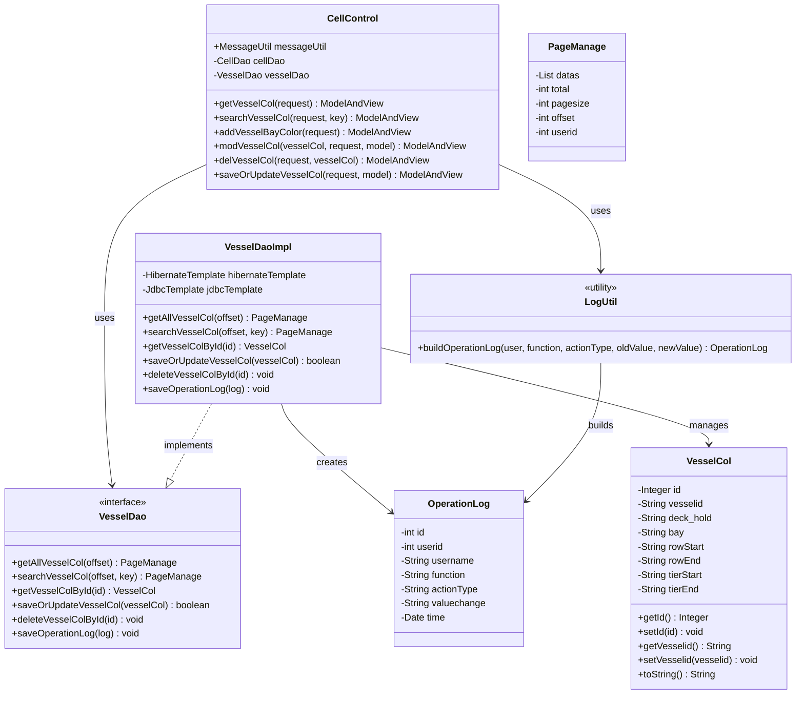

# Vessel Color Configuration - Technical Specification

## 1. Architecture & Service Layer

### 1.1 Module Structure

```text
com.springMVC
├── control
│   └── CellControl.java          # Controller handling all vessel color APIs
├── dao
│   ├── VesselDao.java            # DAO interface
│   └── VesselDaoImpl.java        # DAO implementation with Hibernate/JDBC
├── entity
│   ├── VesselCol.java            # JPA entity for T_VESSELCOL table
│   ├── OperationLog.java         # JPA entity for T_OPERATION_LOG table
│   └── PageManage.java           # Pagination wrapper
└── util
    ├── LogUtil.java              # Audit log builder utility
    └── Constants.java            # Session key constants
```

### 1.2 Service Layer

This module follows a **Controller-DAO** pattern without an explicit service layer. The `CellControl` controller directly invokes `VesselDao` methods.

**Dependency Injection:**
- `CellControl` injects `VesselDao` via `@Resource`
- `VesselDaoImpl` injects `HibernateTemplate` and `JdbcTemplate` via `@Resource`

**Transaction Management:**
- Default transaction propagation: `SUPPORTS` (class-level)
- Write operations use `REQUIRED` propagation (method-level)

> 📎 Source: src/main/java/com/springMVC/dao/VesselDaoImpl.java → @Transactional annotations

## 2. API Contracts

### 2.1 List Vessel Color Configurations

**Endpoint:** `GET /user/allVesselCol`

**Request Parameters:**
| Parameter | Type | Required | Description |
|-----------|------|----------|-------------|
| pager.offset | int | No | Pagination offset (default: 0) |

**Response:** ModelAndView rendering `vesselColorManage` view with `PageManage` object containing:
- `total`: Total record count
- `datas`: List of `VesselCol` entities (max 10 per page)
- `offset`: Current offset
- `pagesize`: 10

> 📎 Source: src/main/java/com/springMVC/control/CellControl.java → getVesselCol()

### 2.2 Search Vessel Color Configurations

**Endpoint:** `GET /user/searchVesselColor`

**Request Parameters:**
| Parameter | Type | Required | Description |
|-----------|------|----------|-------------|
| key | String | Yes | Search keyword for fuzzy matching |
| pager.offset | int | No | Pagination offset (default: 0) |

**Response:** Same structure as list endpoint, filtered by keyword matching `vesselid`, `deck_hold`, or `bay`.

> 📎 Source: src/main/java/com/springMVC/control/CellControl.java → searchVesselCol()

### 2.3 Add Vessel Color Configuration (Form Page)

**Endpoint:** `GET /user/addVesselCol`

**Request Parameters:** None

**Response:** ModelAndView rendering `vesselColorDetail` view (empty form).

> 📎 Source: src/main/java/com/springMVC/control/CellControl.java → addVesselBayColor()

### 2.4 Modify Vessel Color Configuration (Form Page)

**Endpoint:** `GET /user/modifyVesselCol`

**Request Parameters:**
| Parameter | Type | Required | Description |
|-----------|------|----------|-------------|
| id | int | Yes | VesselCol record ID |

**Response:** ModelAndView rendering `vesselColorDetail` view with existing `VesselCol` data.

> 📎 Source: src/main/java/com/springMVC/control/CellControl.java → modVesselCol()

### 2.5 Delete Vessel Color Configuration

**Endpoint:** `GET /user/delVesselCol`

**Request Parameters:**
| Parameter | Type | Required | Description |
|-----------|------|----------|-------------|
| id | int | Yes | VesselCol record ID |

**Response:** Redirect to `/user/allVesselCol.html`

**Side Effects:**
- Deletes the record from `T_VESSELCOL`
- Creates an audit log entry in `T_OPERATION_LOG`

> 📎 Source: src/main/java/com/springMVC/control/CellControl.java → delVesselCol()

### 2.6 Save or Update Vessel Color Configuration

**Endpoint:** `POST /user/saveVesselCol`

**Request Parameters:**
| Parameter | Type | Required | Description |
|-----------|------|----------|-------------|
| id | int | No | Record ID (present for update, absent for create) |
| vesselid | String | Yes | Vessel ID (max 10 chars) |
| deck_hold | String | Yes | Deck/Hold identifier (max 10 chars) |
| bay | String | Yes | Bay number (max 10 chars) |
| rowStart | String | Yes | Start row number (max 10 chars) |
| rowEnd | String | Yes | End row number (max 10 chars) |
| tierStart | String | Yes | Start tier number (max 10 chars) |
| tierEnd | String | Yes | End tier number (max 10 chars) |

**Response:**
- Success: Redirect to `/user/allVesselCol.html`
- Failure: Return `vesselColorDetail` view with error message "The operation failed"

**Business Logic:**
- If `id` is present and valid: Update existing record
- If `id` is absent or invalid: Create new record
- Both paths record audit logs

> 📎 Source: src/main/java/com/springMVC/control/CellControl.java → saveOrUpdateVesselCol()

## 3. Data Model

### 3.1 Table Schema: T_VESSELCOL

| Column | Type | Constraint | Description |
|--------|------|------------|-------------|
| vcid | INTEGER | PK, Sequence: vesselCol_seq | Primary key |
| vesselid | VARCHAR(10) | NOT NULL | Vessel identifier |
| deck_hold | VARCHAR(10) | - | Deck (D) or Hold (H) indicator |
| bay | VARCHAR(10) | - | Bay number |
| rowstart | VARCHAR(10) | - | Start row number |
| rowend | VARCHAR(10) | - | End row number |
| tierstart | VARCHAR(10) | - | Start tier number |
| tierend | VARCHAR(10) | - | End tier number |

> 📎 Source: src/main/java/com/springMVC/entity/VesselCol.java → VesselCol

### 3.2 Table Schema: T_OPERATION_LOG

| Column | Type | Constraint | Description |
|--------|------|------------|-------------|
| OPERLOGID | INTEGER(7) | PK, Sequence: operatorlog_seq | Primary key |
| USERID | INTEGER(7) | - | User ID who performed the action |
| USERNAME | VARCHAR(20) | - | Username who performed the action |
| FUNCTION | VARCHAR(50) | - | Function module name |
| ACTIONTYPE | VARCHAR(10) | - | Action type: Save/Update/Delete |
| VALUECHANGE | VARCHAR(300) | - | Value change in format "oldValue->newValue" |
| TIME | TIMESTAMP | - | Operation timestamp |

> 📎 Source: src/main/java/com/springMVC/entity/OperationLog.java → OperationLog

### 3.3 Class Diagram



## 4. Data Access Logic

### 4.1 Query Conditions

**List Query (`getAllVesselCol`):**
- HQL: `from VesselCol order by vesselid, deck_hold, id`
- No filtering conditions; returns all records
- Pagination: `setFirstResult(offset)`, `setMaxResults(10)`

**Search Query (`searchVesselCol`):**
- HQL: `from VesselCol where vesselid like :vesselid or deck_hold like :deckhold or bay like :bay order by vesselid, deck_hold, id`
- Parameters: All three fields use the same keyword with `%keyword%` pattern
- Pagination: Same as list query

> 📎 Source: src/main/java/com/springMVC/dao/VesselDaoImpl.java → getAllVesselCol(), searchVesselCol()

### 4.2 Filter Rules

- No implicit filters (no soft-delete, no tenant isolation)
- Search uses OR logic across three fields

### 4.3 Sorting Rules

- Fixed sort order: `vesselid ASC, deck_hold ASC, id ASC`
- Applied to both list and search queries

### 4.4 Join Logic

- No joins required; single-table queries only

### 4.5 Implicit Filters

- None implemented

## 5. Business Logic

### 5.1 Calculation Rules

No complex calculations. Data is stored and retrieved as-is.

### 5.2 State Transition Rules

No state machine. Records are either present or deleted.

### 5.3 Default Value Rules

| Field | Default | Source |
|-------|---------|--------|
| OperationLog.time | Current timestamp | `new Date()` |
| OperationLog.valuechange | `"null->null"` or `"oldValue->newValue"` | LogUtil.buildOperationLog() |

> 📎 Source: src/main/java/com/springMVC/util/LogUtil.java → buildOperationLog()

### 5.4 Permission Filtering Rules

- No row-level permission filtering implemented
- User identity is captured from session for audit logging only

⚠️ [OWASP:A01] No authorization checks on API endpoints; any authenticated user can perform CRUD operations on vessel color configurations
> 📎 Source: src/main/java/com/springMVC/control/CellControl.java → all handler methods lack @PreAuthorize or role-based access control annotations

## 6. Integration Points

No external system integrations.

## 7. Error Handling

### 7.1 Error Scenarios

| Scenario | Current Behavior | Risk Level |
|----------|------------------|------------|
| Database connection failure during list/search | Exception caught, stack trace printed, empty page returned | Medium |
| Save/update operation failure | Returns view with "The operation failed" message | Low |
| Invalid ID parameter in modify/delete | Potential NullPointerException or Hibernate exception | High |
| Missing session user during delete/save | NullPointerException when accessing user attributes | High |

### 7.2 Exception Handling Analysis

**List/Search Operations:**
```java
try {
    vesselCol = vesselDao.getAllVesselCol(offset);
} catch (Exception e) {
    e.printStackTrace();  // Only prints stack trace, no user feedback
}
```

⚠️ [ERR:swallowed-exception] Exceptions in list/search operations are caught but not propagated to the user; only stack trace is printed to server logs
> 📎 Source: src/main/java/com/springMVC/control/CellControl.java → getVesselCol() lines 398-400

**Save/Update Operations:**
```java
boolean success = vesselDao.saveOrUpdateVesselCol(vc);
if (success) {
    // log and redirect
} else {
    model.addAttribute("result", "The operation failed");
}
```

The DAO method catches exceptions internally and returns `false` on failure:
```java
public boolean saveOrUpdateVesselCol(VesselCol vesselCol) {
    boolean success = false;
    try {
        this.hibernateTemplate.saveOrUpdate(vesselCol);
        success = true;
    } catch (Exception e) {
        e.printStackTrace();
    }
    return success;
}
```

⚠️ [ERR:no-rollback] Transaction rollback behavior is unclear; saveOrUpdateVesselCol catches exceptions internally which may prevent proper transaction rollback at the controller level
> 📎 Source: src/main/java/com/springMVC/dao/VesselDaoImpl.java → saveOrUpdateVesselCol() lines 252-261

**Delete Operation:**
```java
vesselDao.deleteVesselColById(vesselCol.getId());
User user = (User) request.getSession().getAttribute(Constants.USER_LOGIN);
vesselDao.saveOperationLog(...);
```

⚠️ [ERR:no-rollback] Delete operation and audit log creation are not wrapped in a single transaction; if saveOperationLog fails after delete succeeds, data inconsistency occurs
> 📎 Source: src/main/java/com/springMVC/control/CellControl.java → delVesselCol() lines 432-438

### 7.3 Null Safety Issues

**getVesselColById:**
```java
VesselCol vesselCol = (VesselCol) this.hibernateTemplate.find(sqlString, id).iterator().next();
```

⚠️ [ERR:swallowed-exception] If no record found with given ID, iterator().next() throws NoSuchElementException; no null check or empty collection handling
> 📎 Source: src/main/java/com/springMVC/dao/VesselDaoImpl.java → getVesselColById() line 247

**Session User Access:**
```java
User user = (User) request.getSession().getAttribute(Constants.USER_LOGIN);
```

If user is not logged in or session expired, `user` will be null, causing NullPointerException when calling `user.getId()` or `user.getUsername()`.

⚠️ [ERR:swallowed-exception] No null check on session user before accessing user properties for audit logging
> 📎 Source: src/main/java/com/springMVC/control/CellControl.java → delVesselCol() line 434, saveOrUpdateVesselCol() line 456

## 8. Security

### 8.1 Authentication & Authorization

- Authentication relies on session-based login (`Constants.USER_LOGIN` attribute)
- No explicit authorization checks on vessel color configuration endpoints

⚠️ [OWASP:A01] All vessel color configuration APIs lack role-based access control; any authenticated user can create, modify, or delete configurations
> 📎 Source: src/main/java/com/springMVC/control/CellControl.java → all handler methods

### 8.2 Input Validation

- No server-side validation on input parameters (vesselid, deck_hold, bay, etc.)
- Relies on database column length constraints (VARCHAR(10)) for basic protection
- No sanitization of search keywords

⚠️ [OWASP:A03] Search functionality uses LIKE '%keyword%' without parameterized query protection against SQL injection; although Hibernate parameterized queries are used, the wildcard concatenation pattern could be improved
> 📎 Source: src/main/java/com/springMVC/dao/VesselDaoImpl.java → searchVesselCol() lines 218-231

### 8.3 Audit Logging

- Delete and save/update operations record audit logs
- Log includes: user ID, username, function name, action type, old/new values, timestamp
- Function name used: `VESSEL_REFUEL_BAY_ROW_CONFIGURATION` (misleading naming)

### 8.4 Data Exposure

- No sensitive data in this module
- All fields are operational configuration data

## 9. Performance

### 9.1 Query Optimization

**Pagination Pattern:**
- Uses Hibernate's `setFirstResult()` and `setMaxResults()` for pagination
- Fixed page size of 10 records
- Count query executed separately from data query

⚠️ [PERF:n+1] Separate count query and data query means two database round-trips per list/search request
> 📎 Source: src/main/java/com/springMVC/dao/VesselDaoImpl.java → getAllVesselCol() lines 195-213

**Index Recommendations:**
- Current queries filter/sort by `vesselid`, `deck_hold`, `bay`, `id`
- Recommended composite index: `(vesselid, deck_hold, id)` for optimal sort performance
- For search queries, individual indexes on `vesselid`, `deck_hold`, `bay` would improve LIKE query performance

⚠️ [PERF:no-index] No explicit index definitions visible in entity annotations; database indexes should be verified for T_VESSELCOL table on frequently queried columns
> 📎 Source: src/main/java/com/springMVC/entity/VesselCol.java → VesselCol (no @Index annotations present)

### 9.2 Caching Strategies

- No caching implemented
- Every request hits the database directly

⚠️ [PERF:no-cache] Frequently accessed vessel color configuration list has no caching layer; repeated requests for the same data cause unnecessary database load
> 📎 Source: src/main/java/com/springMVC/dao/VesselDaoImpl.java → getAllVesselCol()

### 9.3 Batch Processing

- No batch operations supported
- Each CRUD operation processes a single record

### 9.4 Large Result Sets

- Pagination limits result sets to 10 records per page
- No risk of unbounded result sets in list/search operations
