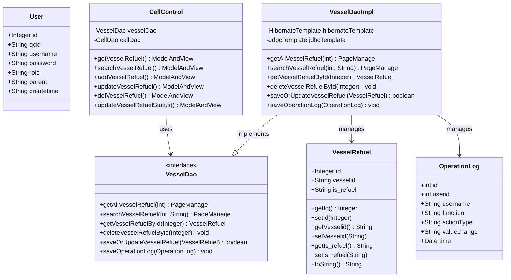

# Vessel Refuel Configuration - Technical Specification

## 1. Architecture & Service Layer

### 1.1 Component Overview

This module follows a traditional Spring MVC architecture with controller-dao pattern (no separate service layer):

```
CellControl (Controller) → VesselDao (Interface) → VesselDaoImpl (Implementation) → Hibernate/JDBC
```

### 1.2 Controller Layer

**Class:** `com.springMVC.control.CellControl`

| Method | HTTP Method | Path | Handler Method |
|--------|-------------|------|----------------|
| List all refuel configs | GET | `/user/allVesselRefuel` | `getVesselRefuel()` |
| Search refuel configs | GET | `/user/searchVesselRefuel` | `searchVesselRefuel()` |
| Add refuel config page | GET | `/user/addVesselRefuel` | `addVesselRefuel()` |
| Modify refuel config page | GET | `/user/modifyVesselRefuel` | `updateVesselRefuel()` |
| Delete refuel config | GET | `/user/delVesselRefuel` | `delVesselRefuel()` |
| Update/Add refuel status | POST | `/user/updateVesselRefuelStatus` | `updateVesselRefuelStatus()` |

> 📎 Source: src/main/java/com/springMVC/control/CellControl.java → getVesselRefuel(), searchVesselRefuel(), addVesselRefuel(), updateVesselRefuel(), delVesselRefuel(), updateVesselRefuelStatus()

### 1.3 DAO Layer

**Interface:** `com.springMVC.dao.VesselDao`

**Implementation:** `com.springMVC.dao.VesselDaoImpl`

Key methods for vessel refuel:
- `getAllVesselRefuel(int offset)` - Paginated list query
- `searchVesselRefuel(int offset, String key)` - Fuzzy search
- `getVesselRefuelById(Integer id)` - Get by ID
- `deleteVesselRefuelById(Integer id)` - Delete by ID
- `saveOrUpdateVesselRefuel(VesselRefuel vr)` - Save or update
- `saveOperationLog(OperationLog log)` - Audit logging

> 📎 Source: src/main/java/com/springMVC/dao/VesselDao.java; src/main/java/com/springMVC/dao/VesselDaoImpl.java

### 1.4 Dependency Injection

- `CellControl` injects `VesselDao` via `@Resource`
- `VesselDaoImpl` injects `HibernateTemplate` and `JdbcTemplate` via `@Resource`
- Transaction management: `@Transactional(propagation = Propagation.SUPPORTS)` at class level, `REQUIRED` for write operations

## 2. API Contracts

### 2.1 GET /user/allVesselRefuel

**Request Parameters:**
| Parameter | Type | Required | Description |
|-----------|------|----------|-------------|
| pager.offset | int | No | Page offset (default: 0) |

**Response:** ModelAndView rendering "vesselRefuelManage" view with `PageManage` object containing 10 records per page.

> 📎 Source: src/main/java/com/springMVC/control/CellControl.java → getVesselRefuel()

### 2.2 GET /user/searchVesselRefuel

**Request Parameters:**
| Parameter | Type | Required | Description |
|-----------|------|----------|-------------|
| key | String | Yes | Search keyword (matches vesselid or is_refuel) |
| pager.offset | int | No | Page offset (default: 0) |

**Response:** ModelAndView rendering "vesselRefuelManage" view with filtered `PageManage` object.

> 📎 Source: src/main/java/com/springMVC/control/CellControl.java → searchVesselRefuel()

### 2.3 GET /user/addVesselRefuel

**Request Parameters:** None

**Response:** ModelAndView rendering "vesselRefuelDetail" view (empty form).

> 📎 Source: src/main/java/com/springMVC/control/CellControl.java → addVesselRefuel()

### 2.4 GET /user/modifyVesselRefuel

**Request Parameters:**
| Parameter | Type | Required | Description |
|-----------|------|----------|-------------|
| vesselRefuel.id | Integer | Yes | Record ID to edit |

**Response:** ModelAndView rendering "vesselRefuelDetail" view with existing data.

> 📎 Source: src/main/java/com/springMVC/control/CellControl.java → updateVesselRefuel()

### 2.5 GET /user/delVesselRefuel

**Request Parameters:**
| Parameter | Type | Required | Description |
|-----------|------|----------|-------------|
| vesselRefuel.id | Integer | Yes | Record ID to delete |

**Response:** Redirect to `/user/allVesselRefuel.html`

> 📎 Source: src/main/java/com/springMVC/control/CellControl.java → delVesselRefuel()

### 2.6 POST /user/updateVesselRefuelStatus

**Request Parameters:**
| Parameter | Type | Required | Description |
|-----------|------|----------|-------------|
| vesselid | String | Yes | Ship ID (max 10 chars) |
| is_refuel | String | Yes | Refuel status flag (max 5 chars) |
| id | String | No | Record ID (if present, updates existing; otherwise creates new) |

**Response:** 
- Success: Redirect to `/user/allVesselRefuel.html`
- Failure: ModelAndView rendering "vesselRefuelDetail" with error message "The operation failed"

> 📎 Source: src/main/java/com/springMVC/control/CellControl.java → updateVesselRefuelStatus()

## 3. Data Model

### 3.1 Entity Classes

**VesselRefuel** (`com.springMVC.entity.VesselRefuel`)

| Field | Column | Type | Constraints | Description |
|-------|--------|------|-------------|-------------|
| id | vrid | Integer | PK, Sequence (vesselRefuel_seq) | Primary key |
| vesselid | vesselid | String(10) | Not null | Ship identifier |
| is_refuel | is_refuel | String(5) | Not null | Refuel status flag |

> 📎 Source: src/main/java/com/springMVC/entity/VesselRefuel.java

**OperationLog** (`com.springMVC.entity.OperationLog`)

| Field | Column | Type | Constraints | Description |
|-------|--------|------|-------------|-------------|
| id | OPERLOGID | int | PK, Sequence (operatorlog_seq) | Primary key |
| userid | USERID | int | Not null | User ID |
| username | USERNAME | String(20) | Not null | Username |
| function | FUNCTION | String(50) | Not null | Function name |
| actionType | ACTIONTYPE | String(10) | Not null | Action type (Save/Update/Delete) |
| valuechange | VALUECHANGE | String(300) | Nullable | Value change (old->new) |
| time | TIME | Date | Not null | Operation timestamp |

> 📎 Source: src/main/java/com/springMVC/entity/OperationLog.java

**User** (`com.springMVC.entity.User`)

| Field | Column | Type | Constraints | Description |
|-------|--------|------|-------------|-------------|
| id | userid | Integer | PK, Sequence (user_seq) | Primary key |
| qcid | QCID | String(20) | Nullable | QC identifier |
| username | NAME | String(20) | Not null | Username |
| password | PASSWORD | String(6) | Not null | Password |
| role | ROLE | String(10) | Nullable | User role |
| parent | PARENT | String(10) | Nullable | Creator |
| createtime | CREATETIME | String(14) | Nullable | Creation time |

> 📎 Source: src/main/java/com/springMVC/entity/User.java

### 3.2 Class Diagram



## 4. Data Access Logic

### 4.1 Query Conditions

**List All (getAllVesselRefuel):**
- HQL: `from VesselRefuel order by vesselid`
- Count HQL: `select count(*) from VesselRefuel order by vesselid`
- Pagination: `setFirstResult(offset).setMaxResults(10)`

> 📎 Source: src/main/java/com/springMVC/dao/VesselDaoImpl.java → getAllVesselRefuel()

**Search (searchVesselRefuel):**
- HQL: `from VesselRefuel where vesselid like :vesselid or is_refuel like :is_refuel order by vesselid`
- Parameters: `vesselid = '%' + key + '%'`, `is_refuel = '%' + key + '%'`
- Pagination: `setFirstResult(offset).setMaxResults(10)`

> 📎 Source: src/main/java/com/springMVC/dao/VesselDaoImpl.java → searchVesselRefuel()

**Get By ID (getVesselRefuelById):**
- HQL: `from VesselRefuel v where v.id=?`
- Returns single entity via iterator

> 📎 Source: src/main/java/com/springMVC/dao/VesselDaoImpl.java → getVesselRefuelById()

### 4.2 Filter Rules

- No implicit filters (no soft-delete, no tenant isolation)
- Search uses OR condition across vesselid and is_refuel fields

### 4.3 Sorting Rules

- All queries sort by `vesselid` ascending

### 4.4 Join Logic

- No joins required; VesselRefuel is a standalone entity

### 4.5 Implicit Filters

- None applied

## 5. Business Logic

### 5.1 Calculation Rules

No complex calculations in this module.

### 5.2 State Transition Rules

**updateVesselRefuelStatus logic:**

```
IF id parameter is present AND not blank:
    1. Parse id to Integer
    2. Fetch existing VesselRefuel by id
    3. IF exists:
        a. Capture oldValue (toString())
        b. Update vesselid and is_refuel
        c. Call saveOrUpdateVesselRefuel()
        d. IF success: Log UPDATE action with oldValue -> newValue
        e. ELSE: Return error view
    4. ELSE (not found): Treat as new record (fall through to else branch)
ELSE:
    1. Create new VesselRefuel
    2. Set vesselid and is_refuel
    3. Call saveOrUpdateVesselRefuel()
    4. IF success: Log SAVE action with null -> newValue
    5. ELSE: Return error view
```

> 📎 Source: src/main/java/com/springMVC/control/CellControl.java → updateVesselRefuelStatus()

### 5.3 Default Value Rules

- OperationLog.time: Auto-set to `new Date()`
- OperationLog.userid/username: Retrieved from session attribute `Constants.USER_LOGIN` ("USERINFO")
- OperationLog.function: Fixed to `LogUtil.Function.VESSEL_REFUEL_CONFIGURATION.getFunction()` = "Vessel Refuel Configuration"
- OperationLog.valuechange: Formatted as `"oldValue->newValue"` where null values are represented as string "null"

> 📎 Source: src/main/java/com/springMVC/util/LogUtil.java → buildOperationLog()

### 5.4 Permission Filtering Rules

- No row-level permission filtering implemented
- Current user is retrieved from session for audit logging only: `(User) request.getSession().getAttribute(Constants.USER_LOGIN)`

> 📎 Source: src/main/java/com/springMVC/control/CellControl.java → delVesselRefuel(), updateVesselRefuelStatus()

⚠️ [OWASP:A01] No authorization checks on API endpoints; any authenticated user can perform CRUD operations on all records
> 📎 Source: src/main/java/com/springMVC/control/CellControl.java → all handler methods

## 6. Integration Points

No external system integrations in this module.

## 7. Error Handling

### 7.1 Error Scenarios

| Scenario | Handling | Error Message |
|----------|----------|---------------|
| Database query failure in list | Exception caught, stack trace printed, empty PageManage returned | None displayed to user |
| Save/Update failure | Boolean success flag checked, error view returned | "The operation failed" |
| NumberFormatException for offset | Caught, offset defaults to 0 | Silent fallback |
| Record not found for update | existVR will be null, falls through to create new record | May cause unexpected behavior |

### 7.2 Risk Annotations

⚠️ [ERR:swallowed-exception] Exceptions in getAllVesselRefuel are caught and only printStackTrace(); user sees empty data without error notification
> 📎 Source: src/main/java/com/springMVC/control/CellControl.java → getVesselRefuel()

⚠️ [ERR:swallowed-exception] saveOrUpdateVesselRefuel catches all exceptions, prints stack trace, and returns false; no specific error information propagated
> 📎 Source: src/main/java/com/springMVC/dao/VesselDaoImpl.java → saveOrUpdateVesselRefuel()

⚠️ [ERR:no-rollback] saveOperationLog catches exceptions silently; audit log failures are not reported and do not rollback the main operation
> 📎 Source: src/main/java/com/springMVC/dao/VesselDaoImpl.java → saveOperationLog()

⚠️ [ERR:swallowed-exception] getVesselRefuelById does not handle case where no record exists; will throw NoSuchElementException from iterator.next()
> 📎 Source: src/main/java/com/springMVC/dao/VesselDaoImpl.java → getVesselRefuelById()

⚠️ [PERF:no-index] HQL queries on VesselRefuel do not specify index hints; ensure database has indexes on vesselid column for search performance
> 📎 Source: src/main/java/com/springMVC/dao/VesselDaoImpl.java → searchVesselRefuel()

## 8. Security

### 8.1 Authentication

- Relies on session-based authentication; user object stored in session under key "USERINFO"
- No explicit authentication check in handlers; assumes middleware/filter handles login

⚠️ [OWASP:A07] No explicit authentication validation in controller methods; relies on external filter/session management
> 📎 Source: src/main/java/com/springMVC/control/CellControl.java → all handler methods

### 8.2 Authorization

- No role-based access control implemented
- All logged-in users have full CRUD access

⚠️ [OWASP:A01] No authorization annotations or checks; any authenticated user can modify/delete any vessel refuel configuration
> 📎 Source: src/main/java/com/springMVC/control/CellControl.java → delVesselRefuel(), updateVesselRefuelStatus()

### 8.3 Input Validation

- vesselid: Limited to 10 characters by entity column definition
- is_refuel: Limited to 5 characters by entity column definition
- id: Parsed as Integer; NumberFormatException handled in offset parsing but not in id parsing for updateVesselRefuelStatus

⚠️ [OWASP:A03] Integer.parseInt(idStr) in updateVesselRefuelStatus has no try-catch; invalid id format will cause unhandled exception
> 📎 Source: src/main/java/com/springMVC/control/CellControl.java → updateVesselRefuelStatus() line 350

### 8.4 Audit Logging

- All DELETE, UPDATE, and SAVE operations log to T_OPERATION_LOG table
- Logs include: user ID, username, function name, action type, value change (old->new), timestamp

### 8.5 Data Exposure

- Password field in User entity is limited to 6 characters (potential security concern if passwords are stored)

⚠️ [OWASP:A02] User.password column limited to 6 characters suggests plaintext or weak hashing; verify password storage mechanism
> 📎 Source: src/main/java/com/springMVC/entity/User.java → password field

## 9. Performance

### 9.1 Query Optimization

- Pagination limits results to 10 records per page
- Search uses LIKE with wildcards on both sides (`%key%`), which prevents index usage

⚠️ [PERF:no-index] LIKE '%key%' pattern in searchVesselRefuel cannot use B-tree indexes efficiently; consider full-text search for large datasets
> 📎 Source: src/main/java/com/springMVC/dao/VesselDaoImpl.java → searchVesselRefuel()

### 9.2 Caching Strategies

- No caching implemented; all queries hit the database directly

⚠️ [PERF:no-cache] No caching layer for frequently accessed vessel refuel configurations; consider adding read-through cache for list operations
> 📎 Source: src/main/java/com/springMVC/dao/VesselDaoImpl.java → getAllVesselRefuel()

### 9.3 Batch Processing

- No batch operations supported
- Each CRUD operation is individual

### 9.4 Pagination Patterns

- Fixed page size of 10 records
- Offset-based pagination (not cursor-based)
- Default offset is 0 when parsing fails
