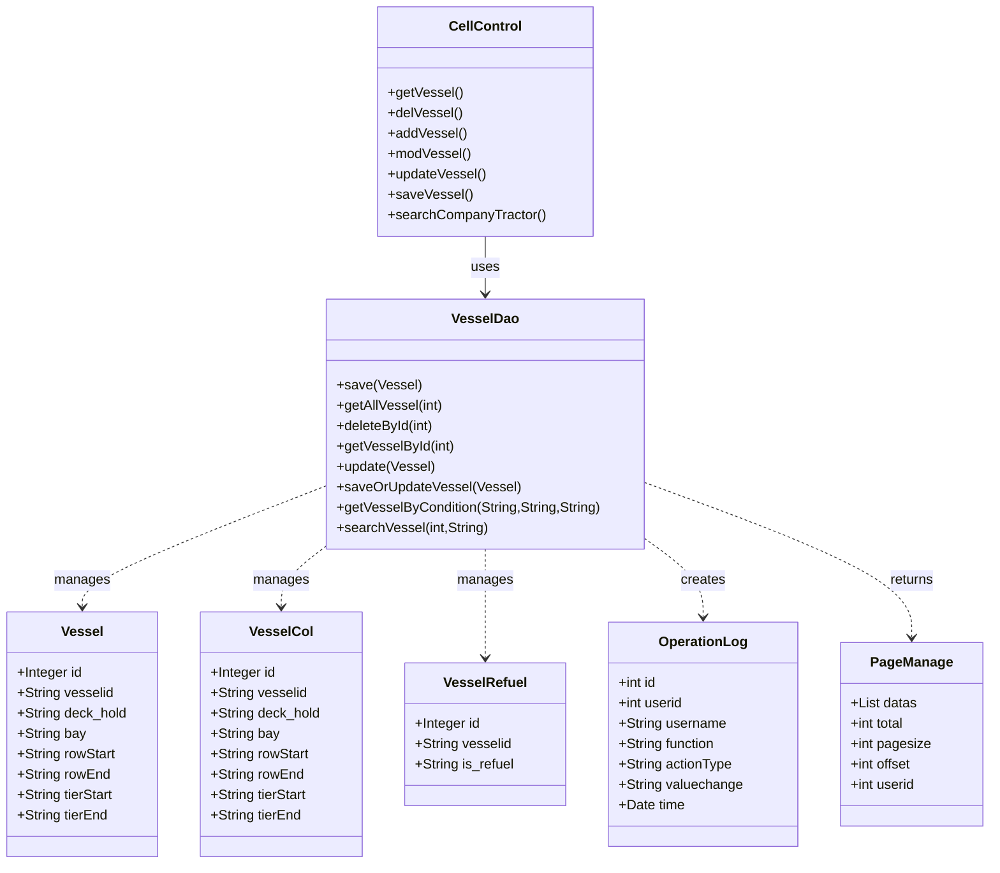

# Vessel Management Module - Technical Specification

## 1. Architecture & Service Layer

### 1.1 Component Overview

The Vessel Management module follows a traditional Spring MVC architecture with Controller-DAO pattern (no separate Service layer).

```text
Controller Layer: CellControl (handles all vessel-related HTTP requests)
DAO Layer: VesselDao (interface) / VesselDaoImpl (implementation)
Entity Layer: Vessel, VesselCol, VesselRefuel, OperationLog
Utility: LogUtil (operation log builder), MessageUtil (i18n messages)
```

### 1.2 Dependency Injection

| Component | Dependency | Injection Type |
|-----------|-----------|---------------|
| CellControl | VesselDao | @Resource |
| CellControl | CellDao | @Resource |
| VesselDaoImpl | HibernateTemplate | @Resource |
| VesselDaoImpl | JdbcTemplate | @Resource |

### 1.3 Transaction Management

- **VesselDaoImpl** uses `@Transactional(propagation = Propagation.SUPPORTS)` at class level
- Write operations (`save`, `deleteById`, `update`, `saveOrUpdate*`) override with `@Transactional(propagation = Propagation.REQUIRED)`
- Read operations inherit SUPPORTS propagation (read-only transactions)

> 📎 Source: src/main/java/com/springMVC/dao/VesselDaoImpl.java → class VesselDaoImpl

## 2. API Contracts

### 2.1 Vessel Base Management APIs

#### GET /user/allVessel
- **Purpose**: List vessels with pagination
- **Query Parameters**: `pager.offset` (integer, default 0)
- **Response**: ModelAndView rendering "vesselManage" view with PageManage object
- **Page Size**: Fixed at 10 records per page

> 📎 Source: src/main/java/com/springMVC/control/CellControl.java → getVessel()

#### GET /user/delVessel
- **Purpose**: Delete vessel by ID
- **Request Body**: Vessel object with `id` field
- **Response**: Redirect to /user/allVessel.html
- **Note**: No confirmation dialog, no operation log recorded for vessel deletion

> 📎 Source: src/main/java/com/springMVC/control/CellControl.java → delVessel()

#### GET /user/addVessel
- **Purpose**: Display add vessel form
- **Response**: ModelAndView rendering "vesselDetail" view

> 📎 Source: src/main/java/com/springMVC/control/CellControl.java → addVessel()

#### GET /user/modifyVessel
- **Purpose**: Display edit vessel form with pre-loaded data
- **Request Body**: Vessel object with `id` field
- **Response**: ModelAndView rendering "updateVessel" view with vessel data

> 📎 Source: src/main/java/com/springMVC/control/CellControl.java → modVessel()

#### POST /user/updateVessel
- **Purpose**: Update existing vessel
- **Request Parameters**: id, vesselid, deck_hold, bay, rowStart, rowEnd, tierStart, tierEnd
- **Validation**: Checks uniqueness of vesselid+deck_hold+bay combination (excluding current record implicitly via query)
- **Response**: 
  - Success: Redirect to /user/allVessel.html
  - Failure: Return to updateVessel view with error message "the vesselid,deck_hold,bay already exists!" or "The operation failed"

> 📎 Source: src/main/java/com/springMVC/control/CellControl.java → updateVessel()

#### POST /user/saveVessel
- **Purpose**: Create new vessel
- **Request Parameters**: vesselid, deck_hold, bay, rowStart, rowEnd, tierStart, tierEnd
- **Validation**: Checks uniqueness of vesselid+deck_hold+bay combination
- **Response**:
  - Success: Redirect to /user/allVessel.html
  - Failure: Return to vesselDetail view with error message

> 📎 Source: src/main/java/com/springMVC/control/CellControl.java → saveVessel()

#### GET /user/searchVessel
- **Purpose**: Search vessels by keyword
- **Query Parameters**: `key` (search keyword), `pager.offset` (default 0)
- **Search Fields**: vesselid, deck_hold, bay (fuzzy match with LIKE %key%)
- **Response**: ModelAndView rendering "vesselManage" view with search results and searchKey

> 📎 Source: src/main/java/com/springMVC/control/CellControl.java → searchCompanyTractor()

### 2.2 Vessel Refuel Configuration APIs

#### GET /user/allVesselRefuel
- **Purpose**: List vessel refuel configurations with pagination
- **Query Parameters**: `pager.offset` (default 0)
- **Response**: ModelAndView rendering "vesselRefuelManage" view

> 📎 Source: src/main/java/com/springMVC/control/CellControl.java → getVesselRefuel()

#### GET /user/searchVesselRefuel
- **Purpose**: Search refuel configurations
- **Query Parameters**: `key`, `pager.offset`
- **Search Fields**: vesselid, is_refuel (fuzzy match)
- **Response**: ModelAndView rendering "vesselRefuelManage" view

> 📎 Source: src/main/java/com/springMVC/control/CellControl.java → searchVesselRefuel()

#### GET /user/addVesselRefuel
- **Purpose**: Display add refuel config form
- **Response**: ModelAndView rendering "vesselRefuelDetail" view

> 📎 Source: src/main/java/com/springMVC/control/CellControl.java → addVesselRefuel()

#### GET /user/modifyVesselRefuel
- **Purpose**: Display edit refuel config form
- **Request Body**: VesselRefuel with `id`
- **Response**: ModelAndView rendering "vesselRefuelDetail" view with data

> 📎 Source: src/main/java/com/springMVC/control/CellControl.java → updateVesselRefuel()

#### GET /user/delVesselRefuel
- **Purpose**: Delete refuel configuration
- **Request Body**: VesselRefuel with `id`
- **Side Effect**: Records operation log with DELETE action type
- **Response**: Redirect to /user/allVesselRefuel.html

> 📎 Source: src/main/java/com/springMVC/control/CellControl.java → delVesselRefuel()

#### POST /user/updateVesselRefuelStatus
- **Purpose**: Save or update refuel configuration (upsert pattern)
- **Request Parameters**: id (optional), vesselid, is_refuel
- **Logic**: 
  - If id provided and exists: update existing record
  - Otherwise: create new record
- **Side Effect**: Records operation log with SAVE/UPDATE action type
- **Response**: Redirect to list page on success, return to form on failure

> 📎 Source: src/main/java/com/springMVC/control/CellControl.java → updateVesselRefuelStatus()

### 2.3 Vessel Color Configuration APIs

#### GET /user/allVesselCol
- **Purpose**: List vessel color configurations with pagination
- **Query Parameters**: `pager.offset` (default 0)
- **Response**: ModelAndView rendering "vesselColorManage" view

> 📎 Source: src/main/java/com/springMVC/control/CellControl.java → getVesselCol()

#### GET /user/searchVesselColor
- **Purpose**: Search color configurations
- **Query Parameters**: `key`, `pager.offset`
- **Search Fields**: vesselid, deck_hold, bay (fuzzy match)
- **Response**: ModelAndView rendering "vesselColorManage" view

> 📎 Source: src/main/java/com/springMVC/control/CellControl.java → searchVesselCol()

#### GET /user/addVesselCol
- **Purpose**: Display add color config form
- **Response**: ModelAndView rendering "vesselColorDetail" view

> 📎 Source: src/main/java/com/springMVC/control/CellControl.java → addVesselBayColor()

#### GET /user/modifyVesselCol
- **Purpose**: Display edit color config form
- **Request Body**: VesselCol with `id`
- **Response**: ModelAndView rendering "vesselColorDetail" view with data

> 📎 Source: src/main/java/com/springMVC/control/CellControl.java → modVesselCol()

#### GET /user/delVesselCol
- **Purpose**: Delete color configuration
- **Request Body**: VesselCol with `id`
- **Side Effect**: Records operation log with DELETE action type
- **Response**: Redirect to /user/allVesselCol.html

> 📎 Source: src/main/java/com/springMVC/control/CellControl.java → delVesselCol()

#### POST /user/saveVesselCol
- **Purpose**: Save or update color configuration (upsert pattern)
- **Request Parameters**: id (optional), vesselid, deck_hold, bay, rowStart, rowEnd, tierStart, tierEnd
- **Logic**: Same upsert pattern as refuel config
- **Side Effect**: Records operation log with SAVE/UPDATE action type
- **Response**: Redirect on success, return to form on failure

> 📎 Source: src/main/java/com/springMVC/control/CellControl.java → saveOrUpdateVesselCol()

## 3. Data Model

### 3.1 Table Schema

#### T_Vessel (Vessel Base Information)

| Column | Type | Constraint | Description |
|--------|------|-----------|-------------|
| vmid | INTEGER | PK, Sequence (vessel_seq) | Primary key |
| vesselid | VARCHAR(10) | NOT NULL | Vessel identifier |
| deck_hold | VARCHAR(10) | NOT NULL | Deck or Hold indicator |
| bay | VARCHAR(10) | NOT NULL | Bay number |
| rowstart | VARCHAR(10) | | Row start position |
| rowend | VARCHAR(10) | | Row end position |
| tierstart | VARCHAR(10) | | Tier start position |
| tierend | VARCHAR(10) | | Tier end position |

**Business Unique Key**: (vesselid, deck_hold, bay)

> 📎 Source: src/main/java/com/springMVC/entity/Vessel.java → class Vessel

#### T_VESSELCOL (Vessel Color Configuration)

| Column | Type | Constraint | Description |
|--------|------|-----------|-------------|
| vcid | INTEGER | PK, Sequence (vesselCol_seq) | Primary key |
| vesselid | VARCHAR(10) | NOT NULL | Vessel identifier (FK reference) |
| deck_hold | VARCHAR(10) | NOT NULL | Deck or Hold indicator |
| bay | VARCHAR(10) | NOT NULL | Bay number |
| rowstart | VARCHAR(10) | | Row start position |
| rowend | VARCHAR(10) | | Row end position |
| tierstart | VARCHAR(10) | | Tier start position |
| tierend | VARCHAR(10) | | Tier end position |

> 📎 Source: src/main/java/com/springMVC/entity/VesselCol.java → class VesselCol

#### T_VesselRefuel (Vessel Refuel Configuration)

| Column | Type | Constraint | Description |
|--------|------|-----------|-------------|
| vrid | INTEGER | PK, Sequence (vesselRefuel_seq) | Primary key |
| vesselid | VARCHAR(10) | NOT NULL | Vessel identifier (FK reference) |
| is_refuel | VARCHAR(5) | | Refuel flag (e.g., "Y"/"N") |

> 📎 Source: src/main/java/com/springMVC/entity/VesselRefuel.java → class VesselRefuel

#### T_OPERATION_LOG (Operation Audit Log)

| Column | Type | Constraint | Description |
|--------|------|-----------|-------------|
| OPERLOGID | INTEGER(7) | PK, Sequence (operatorlog_seq) | Primary key |
| USERID | INTEGER(7) | | User ID from session |
| USERNAME | VARCHAR(20) | | Username from session |
| FUNCTION | VARCHAR(50) | | Function module name |
| ACTIONTYPE | VARCHAR(10) | | Action type: Save/Update/Delete |
| VALUECHANGE | VARCHAR(300) | | Value change in format "old->new" |
| TIME | TIMESTAMP | | Operation timestamp |

> 📎 Source: src/main/java/com/springMVC/entity/OperationLog.java → class OperationLog

### 3.2 Class Diagram



## 4. Data Access Logic

### 4.1 Query Conditions

#### getAllVessel(offset)
- **HQL**: `from Vessel order by vesselid,deck_hold,id`
- **Pagination**: setFirstResult(offset), setMaxResults(10)
- **Count Query**: `select count(*) from Vessel order by vesselid,deck_hold,id`

> 📎 Source: src/main/java/com/springMVC/dao/VesselDaoImpl.java → getAllVessel()

#### searchVessel(offset, key)
- **HQL**: `from Vessel where vesselid like :vesselid or deck_hold like :deckhold or bay like :bay order by vesselid,deck_hold,id`
- **Parameters**: All three parameters set to `%key%` for fuzzy matching
- **Pagination**: Same as getAllVessel

> 📎 Source: src/main/java/com/springMVC/dao/VesselDaoImpl.java → searchVessel()

#### getVesselByCondition(vesselid, deck_hold, bay)
- **HQL**: `from Vessel where vesselid=? and deck_hold=? and bay=?`
- **Purpose**: Uniqueness validation before save/update

> 📎 Source: src/main/java/com/springMVC/dao/VesselDaoImpl.java → getVesselByCondition()

#### getAllVesselCol(offset) / searchVesselCol(offset, key)
- Similar pattern to vessel queries, operating on VesselCol entity
- Search matches: vesselid, deck_hold, bay

> 📎 Source: src/main/java/com/springMVC/dao/VesselDaoImpl.java → getAllVesselCol(), searchVesselCol()

#### getAllVesselRefuel(offset) / searchVesselRefuel(offset, key)
- **Order By**: vesselid only (no deck_hold, bay)
- **Search Fields**: vesselid, is_refuel

> 📎 Source: src/main/java/com/springMVC/dao/VesselDaoImpl.java → getAllVesselRefuel(), searchVesselRefuel()

### 4.2 Filter Rules

- **No soft-delete**: Deletion is physical (Hibernate delete)
- **No tenant isolation**: All users see all records
- **No implicit filters**: Queries return all matching records

### 4.3 Sorting Rules

| Entity | Sort Order |
|--------|-----------|
| Vessel | vesselid ASC, deck_hold ASC, id ASC |
| VesselCol | vesselid ASC, deck_hold ASC, id ASC |
| VesselRefuel | vesselid ASC |

### 4.4 Join Logic

- No JOIN operations in vessel module queries
- External table MN4O_QC_vsl_vessels queried separately via JdbcTemplate for vessel name lookup

> 📎 Source: src/main/java/com/springMVC/dao/VesselDaoImpl.java → getN4VesselNameById()

## 5. Business Logic

### 5.1 Calculation Rules

No complex calculations. The module primarily handles CRUD operations.

### 5.2 State Transition Rules

No state machine. The `is_refuel` field in VesselRefuel is a simple flag without defined state transitions.

### 5.3 Default Value Rules

| Field | Default/Auto-fill | Source |
|-------|------------------|--------|
| OperationLog.time | new Date() | LogUtil.buildOperationLog() |
| OperationLog.userid | Session user ID | From Constants.USER_LOGIN |
| OperationLog.username | Session username | From Constants.USER_LOGIN |
| OperationLog.valuechange | "oldValue->newValue" | LogUtil.buildOperationLog(), null values shown as "null" |

> 📎 Source: src/main/java/com/springMVC/util/LogUtil.java → buildOperationLog()

### 5.4 Permission Filtering Rules

- **No row-level security**: All authenticated users can access all vessel records
- **Session-based user tracking**: Only used for audit logging, not for data filtering
- ⚠️ [OWASP:A01] No authorization checks on API endpoints - any logged-in user can perform all operations including delete
> 📎 Source: src/main/java/com/springMVC/control/CellControl.java → delVessel(), delVesselRefuel(), delVesselCol()

## 6. Integration Points

### 6.1 External System: MN4O_QC_vsl_vessels

| Aspect | Detail |
|--------|--------|
| Purpose | Retrieve vessel name by vessel ID |
| Protocol | JDBC direct SQL query |
| Query | `select name from MN4O_QC_vsl_vessels where id = ?` |
| Method | getN4VesselNameById(String vesselid) |
| Timeout | Not configured (uses default JDBC timeout) |
| Retry | No retry logic |
| Error Handling | Throws exception if vessel not found (queryForObject returns null handling not shown) |

> 📎 Source: src/main/java/com/springMVC/dao/VesselDaoImpl.java → getN4VesselNameById()

⚠️ [ERR:no-timeout] No explicit timeout configured for external vessel name query, may hang indefinitely if database is slow
> 📎 Source: src/main/java/com/springMVC/dao/VesselDaoImpl.java → getN4VesselNameById()

## 7. Error Handling

### 7.1 Error Scenarios

| Scenario | Current Handling | Risk Level |
|----------|-----------------|------------|
| Database connection failure | Catch SQLException, show i18n error message | Medium |
| Duplicate vessel (vesselid+deck_hold+bay) | Check before save, show error message | Low |
| Save/update failure | Catch Exception, print stack trace, return "The operation failed" | High |
| Number format exception (offset parsing) | Catch NumberFormatException, default to 0 | Low |
| Null result from getVesselById | May throw NoSuchElementException from iterator().next() | High |

### 7.2 Risk Annotations

⚠️ [ERR:swallowed-exception] Exceptions in saveOrUpdateVessel, saveOrUpdateVesselCol, saveOrUpdateVesselRefuel are caught and only printed to console, returning false without proper error propagation
> 📎 Source: src/main/java/com/springMVC/dao/VesselDaoImpl.java → saveOrUpdateVessel(), saveOrUpdateVesselCol(), saveOrUpdateVesselRefuel()

⚠️ [ERR:no-rollback] saveOperationLog catches exceptions silently without rollback, potentially losing audit trail
> 📎 Source: src/main/java/com/springMVC/dao/VesselDaoImpl.java → saveOperationLog()

⚠️ [ERR:swallowed-exception] getVesselById uses iterator().next() which throws NoSuchElementException if no result found, no null check
> 📎 Source: src/main/java/com/springMVC/dao/VesselDaoImpl.java → getVesselById()

⚠️ [ERR:swallowed-exception] getVesselColById and getVesselRefuelById have same issue as getVesselById
> 📎 Source: src/main/java/com/springMVC/dao/VesselDaoImpl.java → getVesselColById(), getVesselRefuelById()

⚠️ [PERF:n+1] In CellControl.updateVessel() and saveVessel(), getVesselByCondition is called first for validation, then getVesselById is called again to fetch the entity for update - could be optimized to single query
> 📎 Source: src/main/java/com/springMVC/control/CellControl.java → updateVessel(), saveVessel()

## 8. Security

### 8.1 Authentication & Authorization

- **Authentication**: Relies on session-based authentication (Constants.USER_LOGIN attribute)
- **Authorization**: No method-level or URL-level authorization annotations found
- ⚠️ [OWASP:A01] All vessel management endpoints lack @PreAuthorize or equivalent permission checks - any authenticated user can delete records
> 📎 Source: src/main/java/com/springMVC/control/CellControl.java → delVessel(), delVesselRefuel(), delVesselCol()

### 8.2 Input Validation

- **SQL Injection**: Uses parameterized HQL queries (safe)
- **XSS**: No input sanitization visible; relies on view-layer escaping
- **CSRF**: No CSRF token validation visible in POST handlers
- ⚠️ [OWASP:A03] Request parameters used directly without validation (e.g., request.getParameter("id") parsed to int without range check)
> 📎 Source: src/main/java/com/springMVC/control/CellControl.java → updateVessel(), saveVessel()

### 8.3 Data Access Scope

- All queries return full result sets within pagination limits
- No column-level security or data masking

### 8.4 Audit Logging

- Operation logs recorded for VesselRefuel and VesselCol CRUD operations
- **Missing**: No operation log for Vessel base CRUD operations (add/update/delete)
- ⚠️ [OWASP:A08] Vessel base information changes (create/update/delete) are not audited, creating gap in audit trail
> 📎 Source: src/main/java/com/springMVC/control/CellControl.java → delVessel(), updateVessel(), saveVessel()

## 9. Performance

### 9.1 Query Optimization

| Concern | Detail |
|---------|--------|
| Pagination | Fixed page size of 10, uses Hibernate setFirstResult/setMaxResults |
| Indexing | No explicit index definitions in entity classes; depends on database schema |
| N+1 Queries | Potential N+1 in update/save flows (see Error Handling section) |

⚠️ [PERF:no-index] Entity classes do not define indexes; performance depends on database-level index configuration for vesselid, deck_hold, bay columns
> 📎 Source: src/main/java/com/springMVC/entity/Vessel.java, VesselCol.java

⚠️ [PERF:no-pagination] Search queries use fixed page size of 10 with no option to adjust; large result sets may require many round trips
> 📎 Source: src/main/java/com/springMVC/dao/VesselDaoImpl.java → searchVessel(), searchVesselCol(), searchVesselRefuel()

### 9.2 Caching Strategies

- No caching implemented (no @Cacheable annotations or cache manager usage)
- Each request hits the database directly

⚠️ [PERF:no-cache] Frequently accessed vessel lists have no caching layer; repeated queries for same data hit database every time
> 📎 Source: src/main/java/com/springMVC/dao/VesselDaoImpl.java → getAllVessel()

### 9.3 Batch Processing

- VesselDao has `saveOrUpdateVessel(List vesselList)` method for batch saves, but it is not called from any controller endpoint
- No chunking strategy implemented
